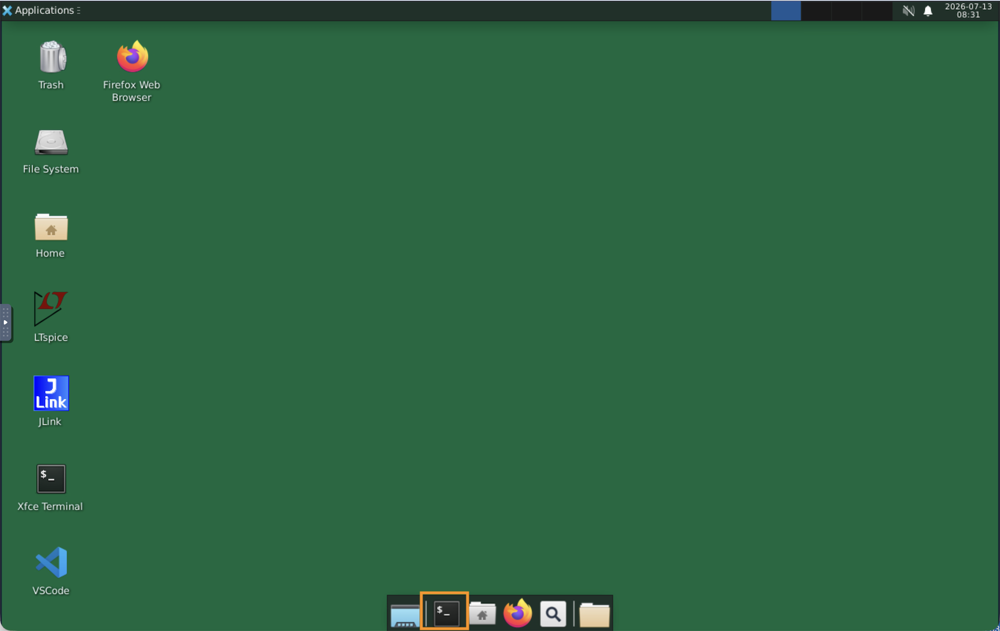
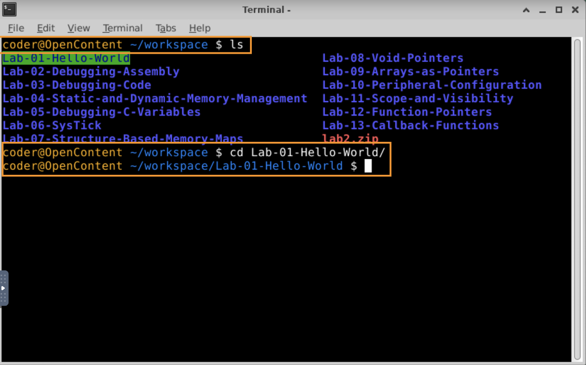
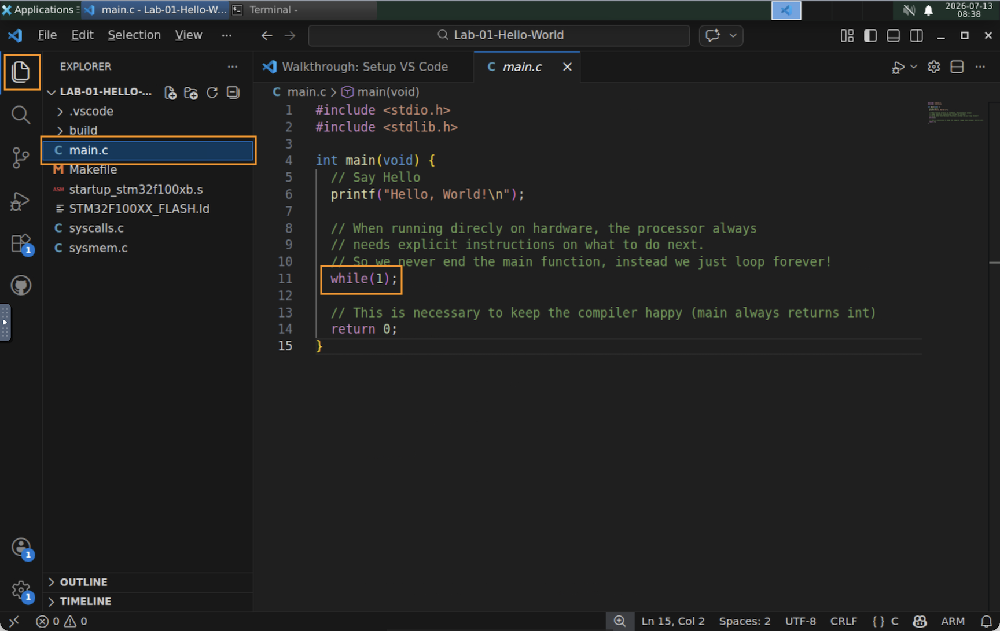
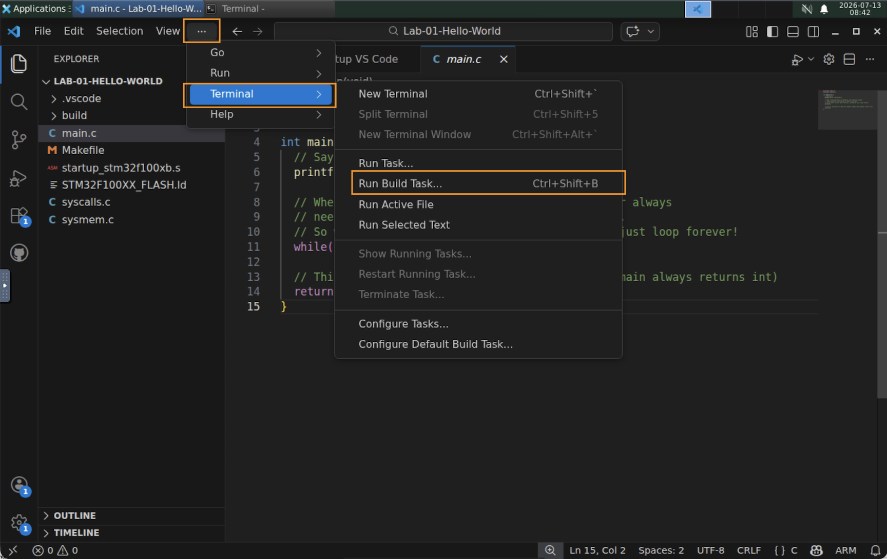
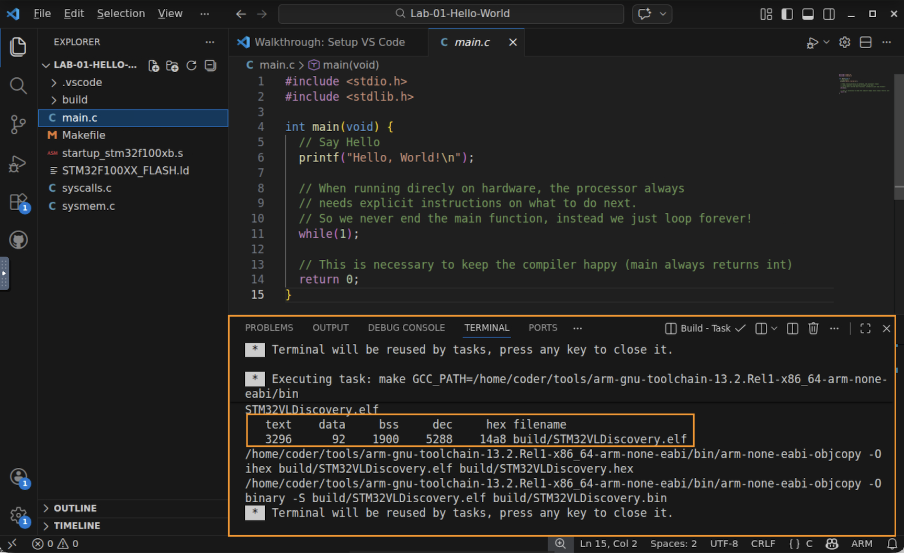
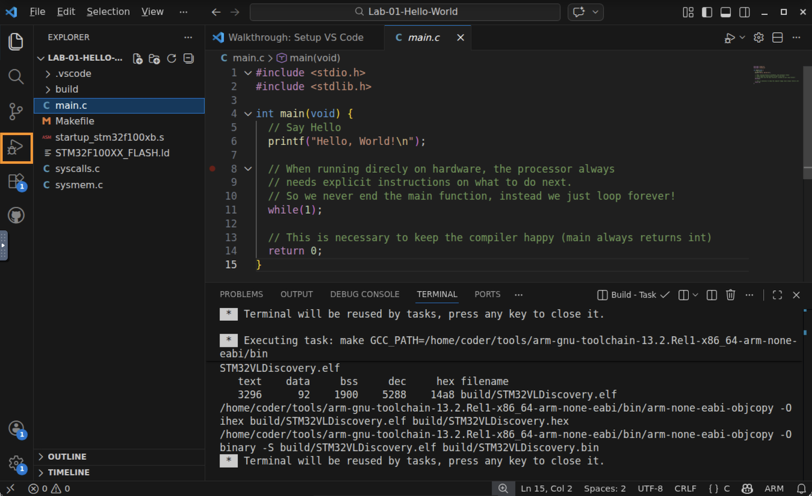
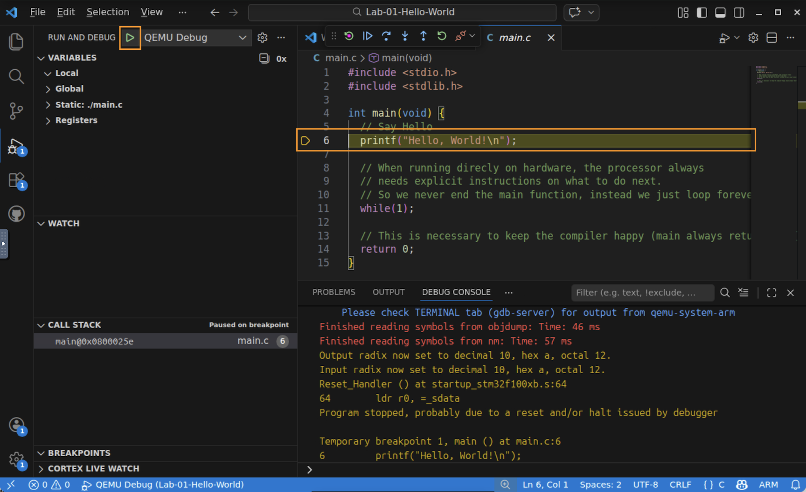
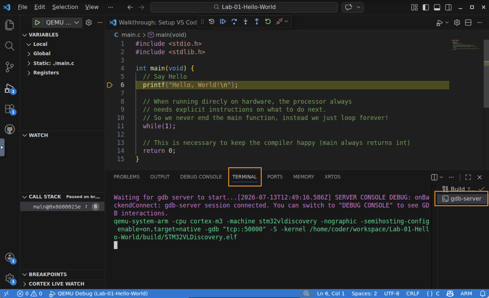
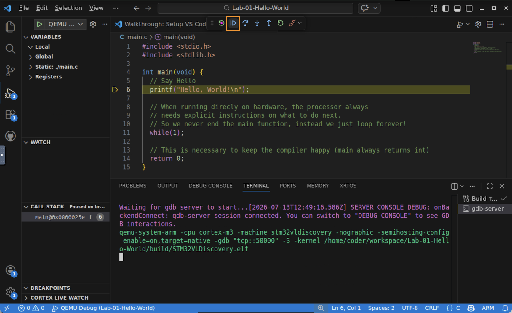
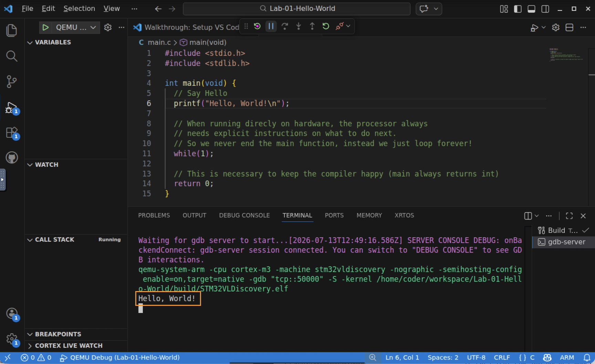

# Lab 1 — Hello, World on Emulated Hardware

> **Overview** · Build, load, and run your first program on emulated hardware and watch its output on a virtual serial terminal.

## In this lab you will
- Launch the Coursera Virtual Lab and open a project in VS Code.
- Build a C program for the STM32F100 (ARM Cortex‑M3) using the cross‑compiler toolchain.
- Load the compiled image onto the QEMU‑emulated STM32VLDISCOVERY board with the debugger.
- Open the virtual serial terminal, run the program, and observe `Hello, World!` printed to the serial terminal by code running on the emulated hardware.

## Before you begin
- **Prerequisites:** watch the Part 1 videos — *C Coding for Hardware* and *Course Tools and Hardware*. This lab repeats, at your own pace, the exact steps demonstrated at the end of that second video.
- **You need:** access to the Coursera Virtual Lab. Everything — the `arm-none-eabi` compiler, QEMU, VS Code, and the debugger — is already installed there. *You do not install anything on your own computer.*
- **Starter code:** this lab folder is complete and ready to build. The files you'll care about:
  | File | What it is |
  |------|------------|
  | `main.c` | The program you'll run — a classic "Hello, World!" |
  | `Makefile` | Build recipe that invokes the cross‑compiler |
  
  You don't need to edit any of these in this lab — you'll build and run the project as‑is.

## Lab objectives
By the end of this lab you will be able to:
1. Navigate from the Virtual Lab desktop into a project open in VS Code.
2. Build a bare‑metal C program into an executable image for the Cortex‑M3.
3. Load and run that image on emulated hardware using the debugger.
4. Observe program output over an emulated serial interface.

---

## Step 1 — Launch the Virtual Lab and open the project

1. Start the Coursera Virtual Lab. After a moment you're greeted by a Linux desktop.

   

2. Open a **terminal** by clicking the terminal icon in the taskbar. It opens in your `~/workspace` folder.
3. List the available labs and change into this one (press **Tab** to autocomplete the folder name):

   ```bash
   ls
   cd Lab-01-Hello-World
   ```

   

4. Launch VS Code in this folder:

   ```bash
   code .
   ```

5. VS Code opens. On the left you'll see the File Explorer listing the project files; the editor shows `main.c`. If you don't see the file list, click the top (Explorer) icon in the left‑hand activity bar.

   

✅ **Checkpoint:** VS Code is open on the `Lab-01-Hello-World` project and you can read `main.c` in the editor.

> 💡 **Look at the code.** Notice `main()` ends with `while(1);` — an infinite loop — instead of just returning. On a bare‑metal system there is no operating system to return to, so the processor must always have something to do. The `return 0;` after it only keeps the compiler happy.

---

## Step 2 — Building the image

"Building" runs the cross‑compiler to turn your C source into a machine‑code image the Cortex‑M3 can execute.

1. From the top menu bar, open **Terminal → Run Build Task** (if the menu bar is collapsed, click the **⋯** overflow menu to find *Terminal*). You can also press **Ctrl+Shift+B**.

   

2. The **Build** task runs `make`, which compiles and links the project. Watch the integrated terminal: it should finish with a size summary and **no errors**. The result is an executable image at `build/STM32VLDiscovery.elf`.

   

✅ **Checkpoint:** the build finished without errors and a `build/` folder now contains `STM32VLDiscovery.elf`.

---

## Step 3 — Loading the image via the debugger

You'll load the image onto the emulated board using the debugger. This both starts QEMU and pauses the program so you can control when it runs.

1. In the left‑hand activity bar, click the **Run and Debug** icon (the ▷ with a small bug). At the top you'll see the **QEMU Debug** configuration.

   

2. Click the green **▶ Start Debugging** triangle next to **QEMU Debug** (or press **F5**). VS Code rebuilds if needed, launches QEMU, loads your image, and **halts at the first line of `main()`** — you'll see that line highlighted.

   

✅ **Checkpoint:** the debugger is running, your program is loaded on the emulated board, and it's paused at the start of `main()`. **It hasn't run yet** — that's next.

---

## Step 4 — Opening the virtual serial terminal

Your program prints with `printf`. On this hardware, that text travels out over a **serial interface**. The hardware emulator is configured to send that serial output to a terminal inside VS Code, so you need that terminal visible before you run.

1. Open the **Terminal** panel at the bottom of VS Code (**Terminal → New Terminal** isn't needed — the debug session already opened the right one). On the right side of the panel you'll see a list of open terminals.
2. Select the **gdb‑server** terminal (this is the one that opened automatically when you started debugging). Its output is where your program's serial text will appear.

   

✅ **Checkpoint:** the gdb‑server terminal is selected and visible. It's blank for now — the program is still paused.

---

## Step 5 — Running the image in the debugger

1. In the debug toolbar at the top, click **Continue** — the blue right‑facing triangle with a bar (▶❚) — or press **F5**. This releases the program from its pause and lets it run.

   

2. Watch the gdb‑server terminal. Your program runs `printf("Hello, World!\n")` and then enters its infinite loop. You should see:

   ```
   Hello, World!
   ```

   

3. When you're done, stop the session with the red **Stop** (⏹) button in the debug toolbar.

✅ **Checkpoint:** you saw `Hello, World!` printed by a program running on an emulated ARM Cortex‑M3. 🎉

---

## What just happened?
You took C source, cross‑compiled it into a machine‑code image for a specific processor (the STM32F100's ARM Cortex‑M3), loaded that image onto an emulated version of that chip, and ran it under a debugger. The `printf` output left the "chip" over a serial interface and arrived in your virtual terminal. Every lab in this course uses this same **build → load → observe** loop, so it's worth getting comfortable with it now. (Remember from the videos: the emulator is reliable and convenient, but it isn't real‑time and doesn't model every hardware detail.)

## Troubleshooting
| Symptom | Likely cause | Fix |
|--------|--------------|-----|
| `code .` does nothing | You're not inside the lab folder | Re‑run `cd Lab-01-Hello-World`, then `code .` |
| Build shows red errors | Editing/renaming a starter file | Restore the original files and build again without editing |
| No `Hello, World!` appears | Wrong terminal selected, or you didn't press Continue | Select the **gdb‑server** terminal, then click **Continue (▶❚)** |
| Debugger won't start | A previous session is still running | Click **Stop (⏹)**, then start **QEMU Debug** again |

## Check your understanding
1. Why does `main()` end with `while(1);` instead of returning?
2. What file does the build produce, and what kind of file is it?
3. When the debugger first loads your program, why don't you immediately see any output?

## Wrap-up
You've run your first program on emulated hardware and learned the build‑load‑run workflow you'll use throughout the course. Next up: the Lesson Assessment, then on to the hardware architecture that makes all of this work.
