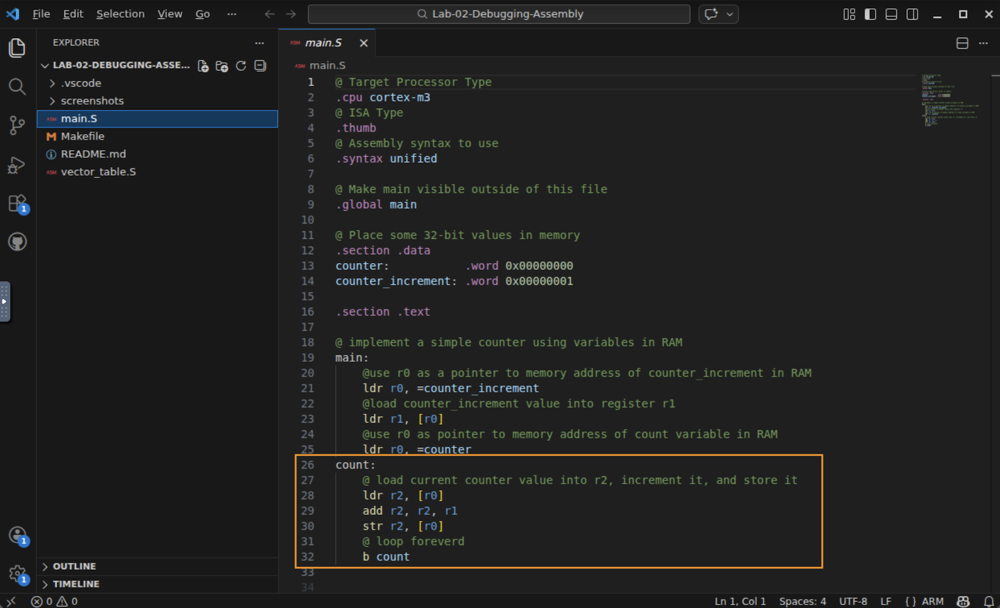
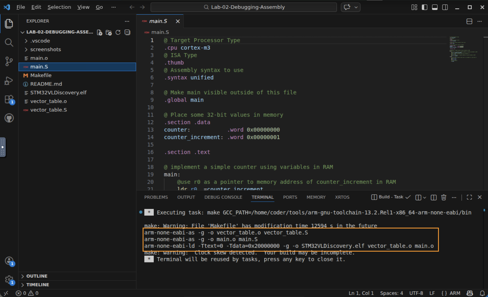
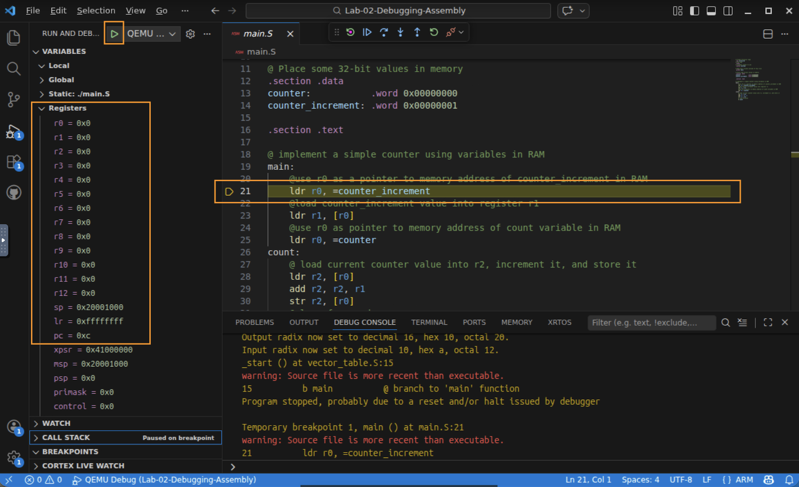
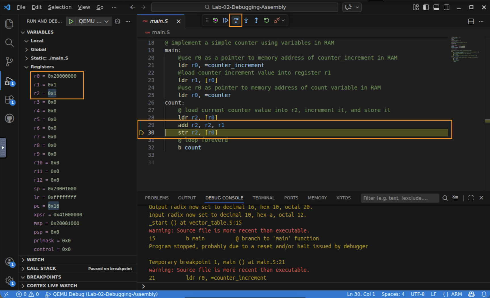
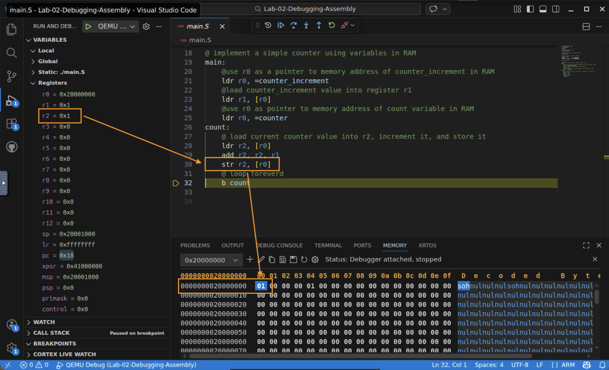
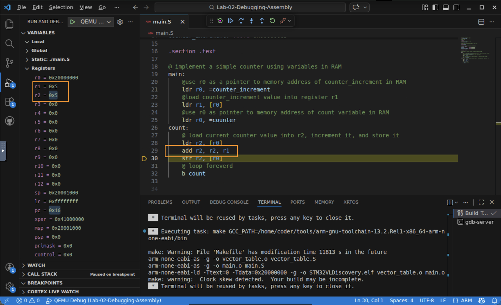

# Lab 2 — Debugging Assembly: Watching the ISA Execute

## In this lab you will
- Build a small ARM assembly program for the Cortex‑M3 (no C this time).
- Run it under the debugger and step one machine instruction at a time.
- Use the Registers view to watch values move into r0, r1, and r2 as instructions run.
- Use the Memory view to watch a counter variable change in RAM as a store executes.
- See the load/store architecture and the four core instructions (LDR, STR, ADD, B) in action.

## Before you begin
- **Prerequisites:** watch the *Instruction Set Architecture* videos and complete Lab 1 (you'll reuse the build → load → debug workflow here).
- **Starter code:** this folder contains a complete, ready‑to‑build assembly project:
  | File | What it is |
  |------|------------|
  | `main.S` | The assembly program: a counter kept in RAM, incremented forever |
  | `vector_table.S` | The reset/stack setup the processor needs at power‑on |
  | `Makefile` | Assembles (`arm-none-eabi-as`) and links (`arm-none-eabi-ld`) into `STM32VLDiscovery.elf` |
  | `.vscode/` | The Build task and QEMU Debug launch configuration |

  You won't edit any file in the main part of this lab (there's an optional edit at the end).

## The program you'll be debugging
`main.S` keeps a counter in RAM and adds to it in an endless loop. Two 32‑bit values live in the `.data` section, which the linker places at the base of RAM:

| Symbol | Address | Initial value |
|--------|---------|---------------|
| `counter` | `0x20000000` | `0x00000000` |
| `counter_increment` | `0x20000004` | `0x00000001` |

The loop does exactly what a load/store core must do: load a value from memory into a register, operate on it in the register, then store the result back to memory.

```
ldr r0, =counter_increment   @ r0 = address 0x20000004
ldr r1, [r0]                 @ r1 = the increment value (1)
ldr r0, =counter             @ r0 = address 0x20000000
count:
    ldr r2, [r0]             @ LOAD  counter from RAM into r2
    add r2, r2, r1           @ ADD   the increment (r2 = r2 + r1)
    str r2, [r0]             @ STORE r2 back to counter in RAM
    b count                  @ BRANCH back and do it again
```

Keep these four instructions in mind as you step: **LDR** (load), **ADD**, **STR** (store), **B** (branch).

---

## Step 1 — Open the project and read the code
1. Open a terminal, change into this lab folder, and launch VS Code:
   ```bash
   cd Lab-02-Debugging-Assembly
   code .
   ```
2. Open `main.S` and find the `count:` loop shown above. Notice there is no C here: these lines are ARM assembly, one line per machine instruction.

   

✅ Checkpoint: you can see the `ldr` / `add` / `str` / `b` loop in `main.S`.

## Step 2 — Build the assembly image
1. Run Terminal → Run Build Task (or Ctrl+Shift+B). Unlike Lab 1, this calls the assembler (`arm-none-eabi-as`) and linker (`arm-none-eabi-ld`) directly, producing `STM32VLDiscovery.elf`.
2. Confirm the build finishes with no errors.

   

✅ Checkpoint: the build succeeded and `STM32VLDiscovery.elf` exists in the folder.

## Step 3 — Start the debugger and open the Registers view
1. In the Run and Debug view, start QEMU Debug (green ▶ / F5). Execution loads and halts at `main`.
2. Open the Registers view so you can watch the core's registers. With cortex‑debug, the core registers (`r0` through `r15`) appear in a Registers section of the Run and Debug sidebar. Values are shown in hexadecimal.
3. Find r0, r1, and r2 — these are the registers this program uses.

   

✅ Checkpoint: the program is paused at `main` and you can see the register values.

## Step 4 — Step through and watch the registers change
1. Use Step Over (F10) to execute one instruction at a time. Because the source is assembly, each step runs exactly one machine instruction.
2. Watch the registers as you step:
   - after `ldr r1, [r0]`, **r1** holds the increment value `0x00000001`;
   - inside the loop, `ldr r2, [r0]` loads the current counter into **r2**;
   - `add r2, r2, r1` makes **r2** increase by one right before your eyes.

   

✅ Checkpoint: you watched a single ADD instruction change a register.

## Step 5 — Open the Memory view and watch the store
The `add` changed a register copy. The counter in RAM only updates when the store (`str`) runs. Let's watch that happen.

1. Open a Memory view and point it at the counter's address, `0x20000000`. (In cortex‑debug this is available from the Command Palette, e.g. *Cortex‑Debug: View Memory* / *Examine Memory*; enter `0x20000000`.)
2. Step until you execute `str r2, [r0]`. The 32‑bit word at `0x20000000` updates to match r2.
3. Keep stepping through the loop (the `b count` branch sends you back to `ldr r2, [r0]`). Each time the `str` runs, the value in memory climbs by one.

   

✅ Checkpoint: you saw the STR instruction write a register value back into RAM — the "store" half of load/store.

## Step 6 (optional, ~3 min) — Change the increment
Prove to yourself that the source controls the behavior:
1. Stop the debugger (red ⏹).
2. In `main.S`, change `counter_increment` from `0x00000001` to `0x00000005`.
3. Rebuild (Ctrl+Shift+B) and start QEMU Debug again.
4. Step through the loop and confirm the counter now climbs by 5 each time instead of 1.

   

✅ Checkpoint: you connected a change in the assembly source to a change in the running hardware behavior.

---

## What just happened?
You watched the load/store architecture work exactly as described in the videos: the core cannot add to a value while it sits in memory. It must load the value into a register (`ldr`), add in the register (`add`), and store the result back (`str`). The `b` instruction just loops. These four mnemonics *are* machine instructions from the Cortex‑M3 ISA, and the debugger's Registers and Memory views let you watch each one take effect. This build‑load‑step‑inspect skill is how you'll debug real programs for the rest of the course.

## Troubleshooting
| Symptom | Likely cause | Fix |
|--------|--------------|-----|
| Build errors mentioning `as` or `ld` | A starter file was edited/renamed | Restore the original files and rebuild |
| Registers don't change when you step | You clicked Continue instead of Step | Use Step Over (F10) to advance one instruction at a time |
| Memory view shows all zeros | You haven't stepped through a `str` yet, or wrong address | Confirm the address is `0x20000000` and step past `str r2, [r0]` |
| Counter value looks like a huge hex number | It simply wrapped or you set a large increment | That's fine — it's a 32‑bit value counting up |

## Check your understanding
1. After `add r2, r2, r1` runs, has the counter in RAM changed yet? Why or why not?
2. Which instruction actually writes the new value back to memory?
3. What does the `b count` instruction do, and why does the program never stop?
4. If you set `counter_increment` to `0x00000010`, what would you expect to see in r2 after each `add`?

## Wrap-up
You've now seen individual machine instructions execute and change the processor's registers and memory. Next up is the Lesson Assessment for this part, then the module moves on to how a C compiler turns your C into exactly these kinds of instructions.
