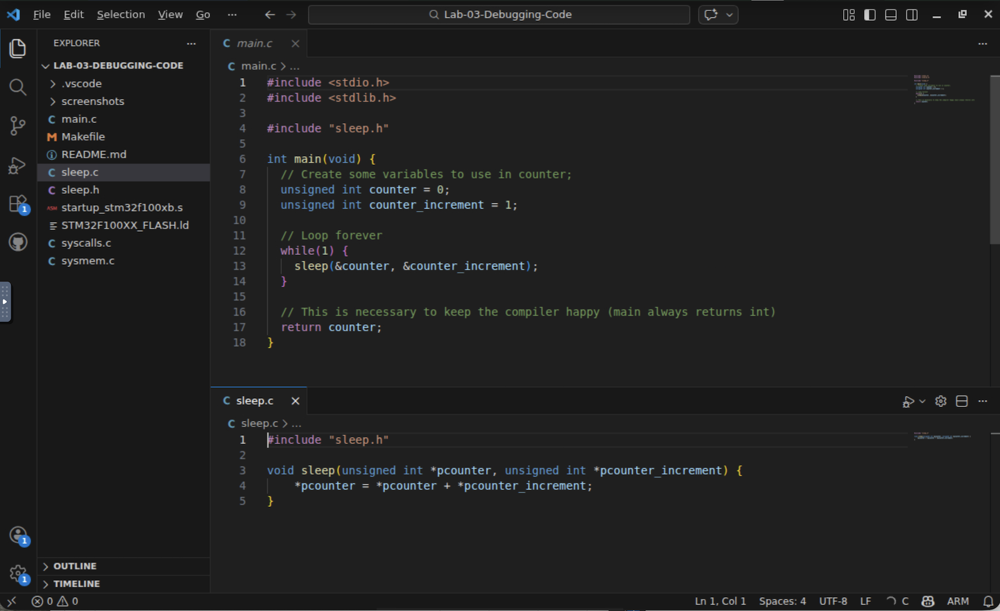
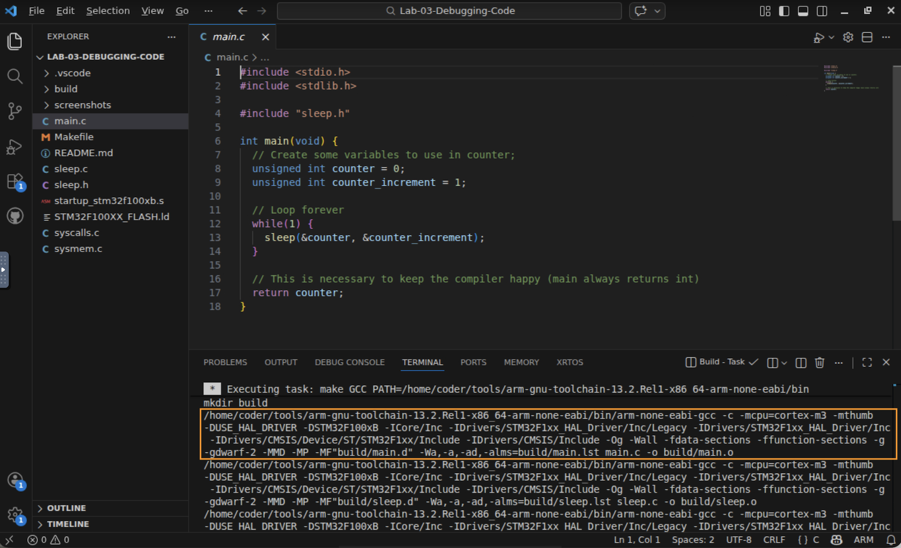
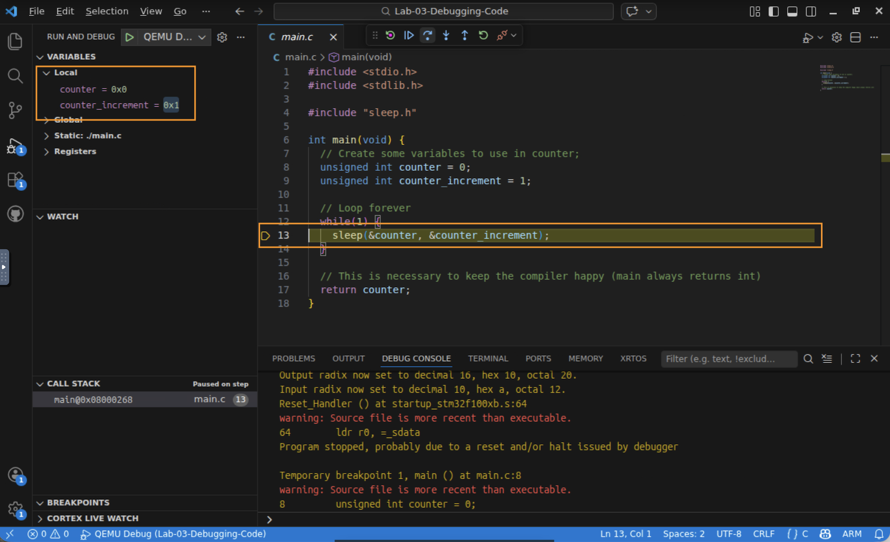
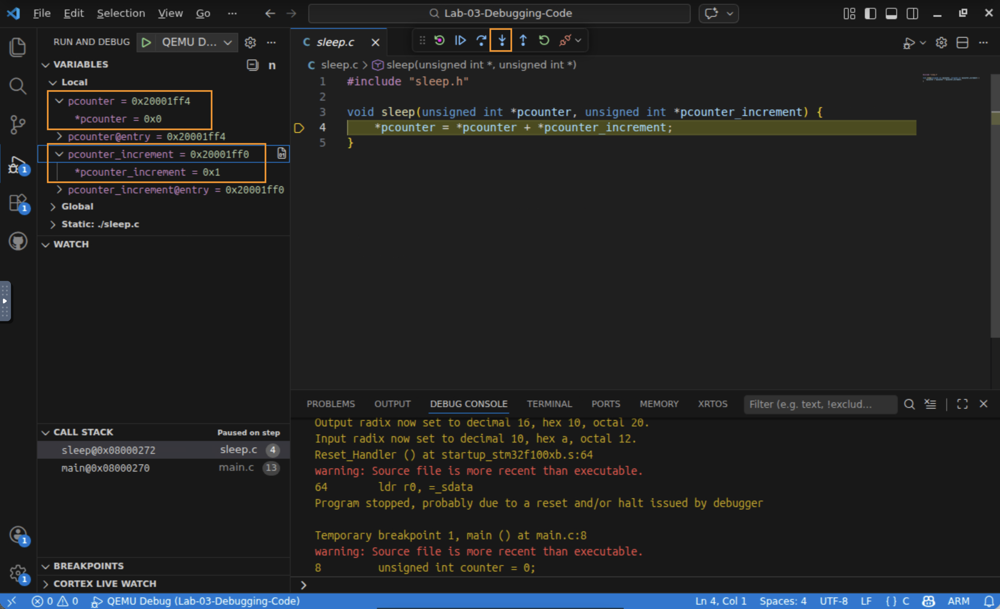
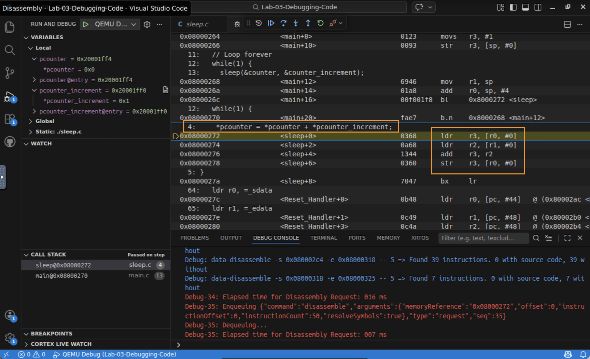
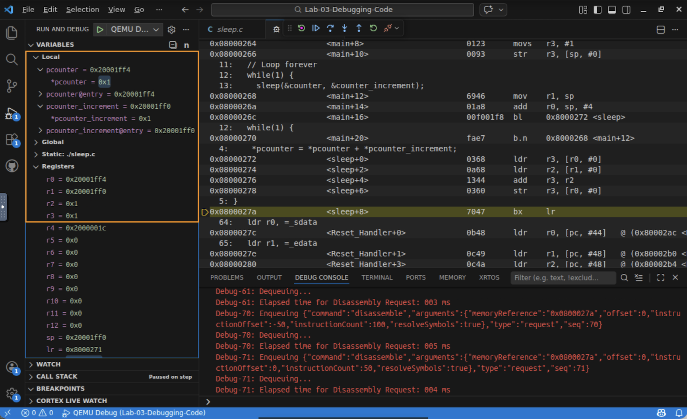

# Lab 3 — From C to the ISA: Debugging Compiled Code


## In this lab you will
- Build a C program and read the cross‑compiler invocation in the build output (the flags that target the Cortex‑M3).
- Debug at the C level: step through source lines and watch variables and pointers.
- Step into a function and open the Disassembly View to see the compiler's machine‑instruction output.
- Match your C to the generated LDR / ADD / STR instructions and the registers that hold each value.
- Change an optimization flag and watch the generated instructions change.

## Before you begin
- Prerequisites: watch the *Compilers: Transforming C to the ISA* video, and complete Lab 1 (build/debug workflow) and Lab 2 (reading assembly, registers, and the memory/registers views).
- Starter code: a small C project that increments a counter through a pointer:
  | File | What it is |
  |------|------------|
  | `main.c` | Declares `counter` and `counter_increment`, then loops calling `sleep(&counter, &counter_increment)` |
  | `sleep.c` / `sleep.h` | A one‑line function that adds through pointers: `*pcounter = *pcounter + *pcounter_increment` |
  | `Makefile` | Cross‑compiles with `arm-none-eabi-gcc` for the Cortex‑M3 |
  | `.vscode/` | The Build task and QEMU Debug launch configuration |


## A quick pointer refresher
The video reviews C pointers, and this lab uses them. In `main.c`, `&counter` is the address of `counter`. `sleep` receives that address in a pointer (`unsigned int *pcounter`) and uses `*pcounter` to dereference it (read or write the value at that address). So `*pcounter = *pcounter + *pcounter_increment;` reads both values, adds them, and writes the result back to `counter`. Keep this in mind: it's the same load, add, store idea you saw in Lab 2, but written in C.

---

## Step 1 — Open the project and read the C
1. Open a terminal, change into this lab folder, and launch VS Code:
   ```bash
   cd Lab-03-Debugging-Code
   code .
   ```
2. Open `main.c` and `sleep.c`. Confirm you understand how `main` passes the addresses of the two variables to `sleep`, and how `sleep` uses the pointers to do the addition.

   

✅ Checkpoint: you can explain, in words, what `sleep` does to `counter`.

## Step 2 — Build, and read the compiler invocation
1. Run Terminal → Run Build Task (Ctrl+Shift+B). Watch the build output scroll by.
2. Find the line where `arm-none-eabi-gcc` compiles `main.c`. Notice the key arguments that steer the compiler:
   - `-mcpu=cortex-m3` — target only the Cortex‑M3's instruction set (the "blue box" from the ISA video).
   - `-mthumb` — use the compact Thumb encoding.
   - `-Og` — optimize "gently", keeping the output easy to read and debug.
   - `-g -gdwarf-2` — include debug information so you can step through the code.

   

✅ Checkpoint: you found the cross‑compiler command and can point to the flag that selects the Cortex‑M3.

> 💡 Cross‑compiling: this compiler runs on your Linux (Intel) machine but produces ARM Cortex‑M3 code. Building for a different processor than the one you're running on is called *cross‑compiling*.

## Step 3 — Debug at the C level
1. In Run and Debug, start QEMU Debug (green ▶ / F5). It halts at the first line of `main`.
2. In the Variables view, watch `counter` and `counter_increment`. Before you run the assignment lines, `counter_increment` holds a leftover value; Step Over (F10) the two declarations and watch it become `1`.

   

✅ Checkpoint: you can see C variable values update as you step.

## Step 4 — Step into the function and inspect the pointers
1. With the next `sleep(...)` call highlighted, use Step Into (F11) to go inside `sleep` (Step Over would skip past it).
2. Expand the pointer parameters `pcounter` and `pcounter_increment`. You'll see the addresses they hold (in RAM, which starts at `0x20000000`) and, if you expand them, the **values** they point to (`0` and `1`).

   

✅ Checkpoint: you can see that a pointer holds an address, and dereferencing it reaches the value.

## Step 5 — Open the Disassembly View
Now see what the compiler actually produced from that one line of C.
1. With execution inside `sleep`, right‑click in the editor and choose Open Disassembly View (near the bottom of the menu).
2. Read the generated assembly. You should see the familiar load/store pattern: load the two values into registers, add them, and store the result back. These are the same kinds of instructions (LDR, ADD, STR) you wrote by hand in Lab 2, but the compiler generated them from your C.

   

✅ Checkpoint: you can point to the instruction that adds, and the one that stores the result back to memory.

## Step 6 — Match C to registers, one instruction at a time
1. In the Disassembly View you can step one machine instruction at a time. Open the Registers view alongside it.
2. Match the values to the C. As demonstrated in the video, you'll typically see:
   - r0 = the pointer to `counter` (an address)
   - r1 = the pointer to `counter_increment` (an address)
   - r2 = the increment value loaded from memory
   - r3 = the current counter value being worked on
   (Exact register numbers and addresses can vary; the point is that each C value lives in a register while the core works on it.)

   

✅ Checkpoint: you connected each C variable to a processor register and watched the add happen at the machine level.

---

## What just happened?
You watched the whole chain from C to hardware: your `sleep` function, one line of C using pointers, became a short sequence of load, add, store machine instructions for the Cortex‑M3, chosen by the compiler based on the flags you passed it. The debugger let you move between the C view (variables and pointers) and the machine view (disassembly and registers) of the *same running program*. Being able to switch between these two views, and to see how compiler arguments shape the output, is a core skill for embedded C development.

## Troubleshooting
| Symptom | Likely cause | Fix |
|--------|--------------|-----|
| Step Over skipped `sleep` | Step Over runs a call without entering it | Use Step Into (F11) on the `sleep(...)` line |
| No "Open Disassembly View" in the menu | Right‑clicked outside the editor, or not in a debug session | Right‑click inside the source editor while paused in the debugger |
| Disassembly looks totally different from the video | You changed `OPT`, or the compiler inlined the function | Set `OPT = -Og` in the Makefile and rebuild |
| Variables show odd values before you step | The lines that set them haven't run yet | Step Over the declaration lines first, then look again |

## Check your understanding
1. What is the difference between `counter`, `&counter`, and `*pcounter`?
2. Which compiler flag tells `arm-none-eabi-gcc` to target the Cortex‑M3 instruction set?
3. In the disassembly of `sleep`, which instruction writes the new counter value back to memory?
4. Why might you deliberately build with `-Og` or `-O0` instead of `-O2` while debugging?

## Wrap-up
You've now seen your C transformed into the exact kind of instructions you wrote by hand in Lab 2, and you can inspect that transformation whenever you need to. This wraps up the core skills; next is the module review and assessment.