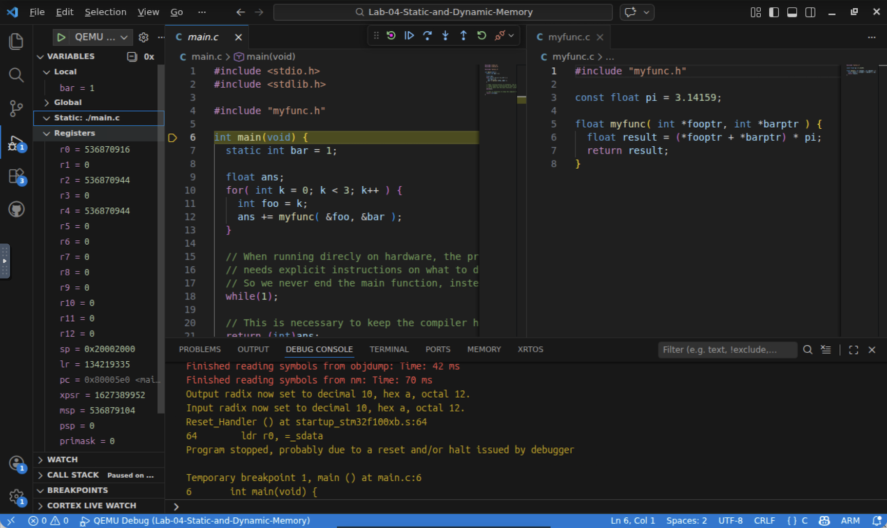
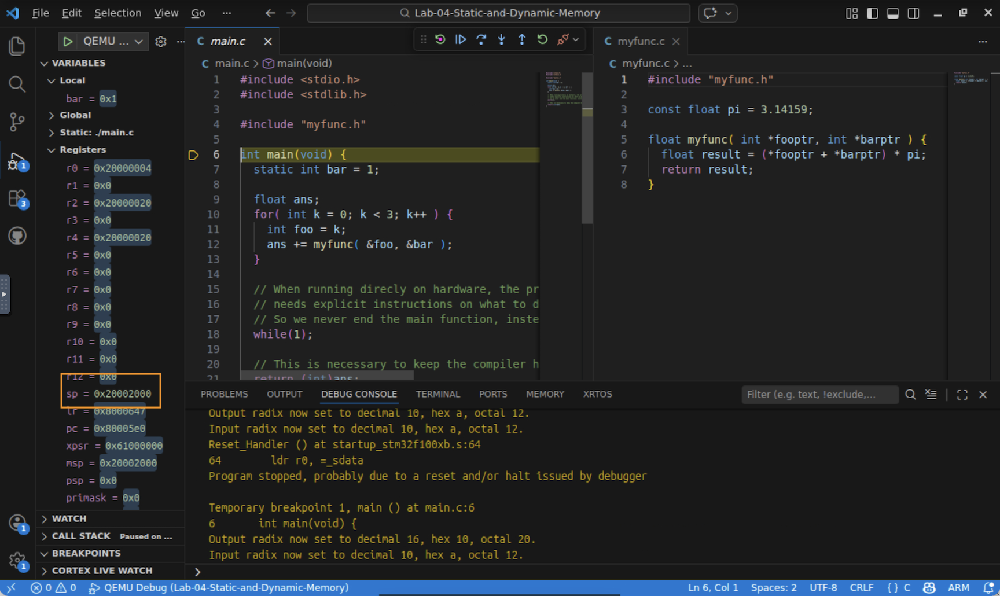
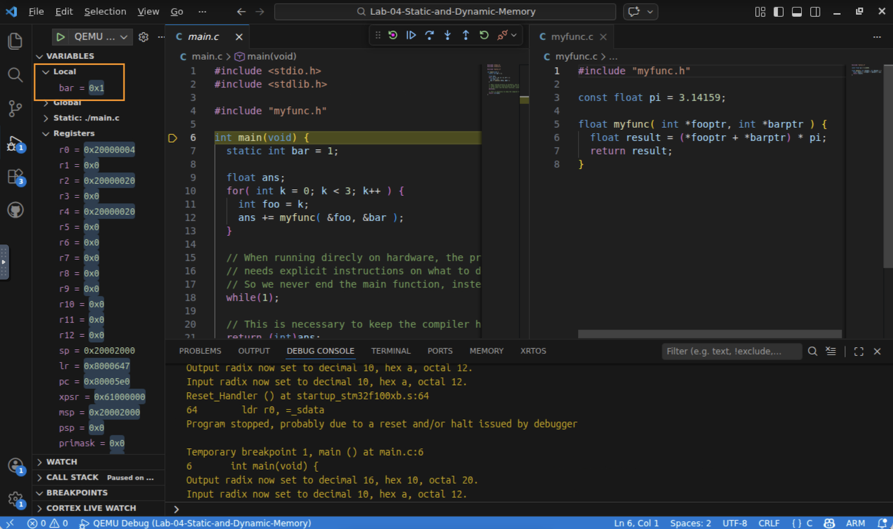
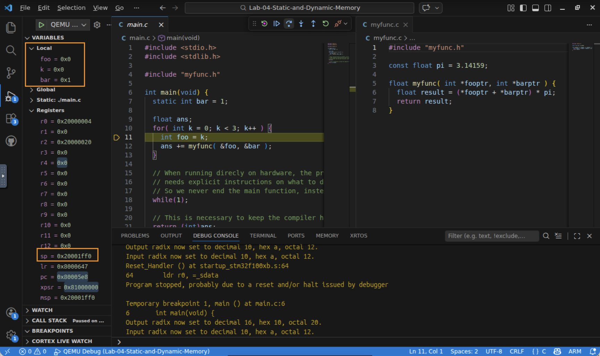
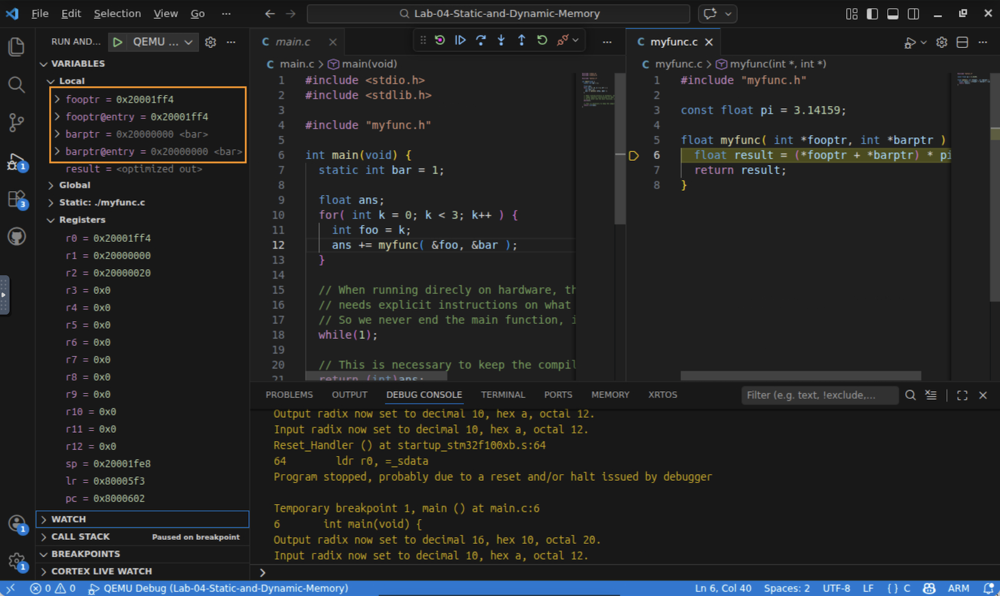
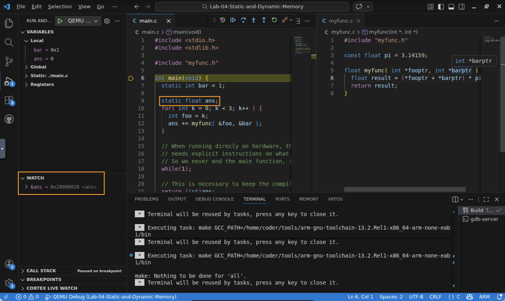
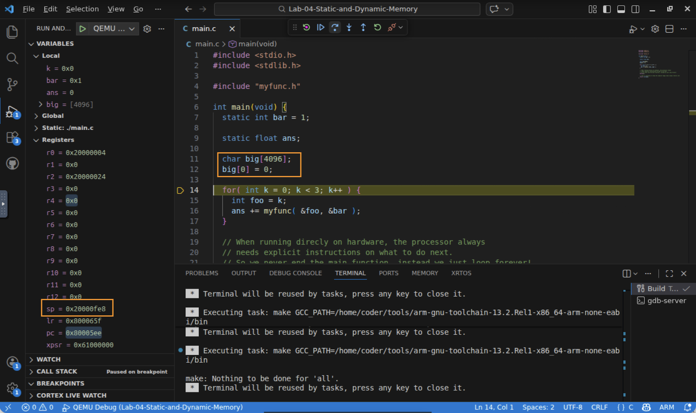

# Lab 4 — Static, Temporary, and the Stack: Where Do Variables Live?

## In this lab you will
- Identify the storage class of each variable in a small program (static, const, temporary).
- Predict where each variable will live in memory, then verify the actual addresses in the debugger.
- Use the Stack Pointer (SP) register to watch temporary variables get allocated and freed at runtime.
- Control allocation: change a variable's storage class and confirm it moves to a different region of memory.
- Reason about the tradeoffs and the danger of stack corruption on a memory‑limited device.

## Before you begin
- Prerequisites: watch the *Static and Dynamic Memory Allocation* video, and complete Labs 1–3 (build/debug, Variables, Registers, and pointers).
- The memory map you'll use: on the STM32F100, RAM runs from `0x20000000` to `0x20001FFF` (8 KB), and flash starts at `0x08000000` (128 KB). The Stack Pointer starts at `0x20002000` (just past the end of RAM) and grows downward.
- Starter code: a small program whose variables span three storage classes:
  | Variable | Where it's declared | Storage class |
  |----------|---------------------|---------------|
  | `bar` | `static int bar` in `main` | Static (reserved for the whole program) |
  | `pi` | `const float pi` in `myfunc.c` | Const (read‑only) |
  | `ans`, `foo`, `k` | plain locals in `main` | Temporary (stack) |
  | `result` | plain local in `myfunc` | Temporary (stack) |

  > Note: `ans` starts as an uninitialized temporary, so it holds leftover "garbage" until it is assigned. That's expected, and it's part of the point: a temporary has no meaningful value until it exists.

## Predict first
Before you touch the debugger, write down your prediction for where each variable will live:

| Variable | Your prediction (flash `0x08…`, base of RAM `0x2000_00…`, or stack near `0x2000_1FF…`) |
|----------|-----------------|
| `bar` (static) | ? |
| `pi` (const) | ? |
| `foo` (temporary) | ? |

Keep these predictions handy. You'll check them in Step 5.

---

## Step 1 — Open the project and classify the variables
1. Open a terminal, `cd Lab-04-Static-and-Dynamic-Memory`, and run `code .`.
2. Read `main.c` and `myfunc.c`. For each variable, decide: is it static (has `static`, or is a global), const, or a temporary local?

   

✅ Checkpoint: you can name the storage class of `bar`, `pi`, `foo`, `k`, and `result`.

## Step 2 — Build, start the debugger, and find the Stack Pointer
1. Build (Ctrl+Shift+B) and start QEMU Debug (F5). It halts at the start of `main`.
2. Open the Registers view and find SP (the Stack Pointer). It should read about `0x20002000`, just past the end of RAM. Nothing has been pushed yet.

   

✅ Checkpoint: SP points just past the top of RAM, because no temporaries have been allocated yet.

> 💡 How the stack grows: on the ARM Cortex‑M, a push *decrements* SP first, then stores. So the stack fills downward from the top of RAM toward the base.

## Step 3 — See what exists (and what doesn't) yet
1. In the Variables view, notice that `bar` (static) already has a stable value: the compiler reserved space for it at build time, so it always exists.
2. `ans`, `foo`, and `k` are temporaries. They don't exist yet, or show garbage: the debugger can't point to something that hasn't been created.

   

✅ Checkpoint: you can explain why the debugger can always find `bar` but not `foo`.

## Step 4 — Watch temporaries get allocated on the stack
1. Step (F10) into the `for` loop. As `k` and then `foo` come into scope, they appear, and the SP decreases: the compiler grabbed a chunk of stack for them.
2. Note how far SP dropped from `0x20002000`.

   

✅ Checkpoint: you saw the Stack Pointer move to make room for temporary variables.

## Step 5 — Verify the addresses (check your predictions)
1. Step Into (F11) `myfunc`. Expand the pointer parameters and hover the variables to see their addresses.
2. Compare to your predictions from *Predict first*:
   - `bar` (static) should sit near the base of RAM, around `0x20000000`.
   - `foo` (temporary) should sit near the top of RAM, in the stack region (around `0x2000_1FF…`).
   - `pi` (const) should live in flash, with an address starting `0x08…` (const data is read‑only, so it goes with the program in flash not RAM.  *Note it may not be visible in the variables view since it is stored with program code not as program data*).

   

✅ Checkpoint: your predictions match the actual memory regions (static low in RAM, temporaries high in RAM, const in flash).

## Step 6 — Watch a temporary disappear
1. Continue stepping until you leave `myfunc` and the loop body. Watch `result`, then `foo`/`k`, pop off the stack: they stop existing and SP returns toward `0x20002000`.

✅ Checkpoint: you saw temporaries freed automatically when they went out of scope. *(This is the "repeat the video" part; now let's extend it.)*

---

## Step 7 (extend) — Control the allocation yourself
The video mentions a debugging trick: make a temporary static so the debugger can always find it. Let's do it and confirm the variable physically moves.
1. Stop the debugger. In `main.c`, change `float ans;` to `static float ans = 0;`.
2. Rebuild and debug again. This time, predict: where will `ans` live now, base of RAM or the stack?
3. Verify: Add `&ans` as a WATCH variable to add the address of ans. Click the '+' icon to the right of WATCH in the variables view to create this watch variable.  Notice that ans` now sits with the other static data near the base of RAM, it exists from the very first line of `main`, and the debugger can always find it (even outside the loop).

   

✅ Checkpoint: by changing one keyword you moved a variable from the stack to the static region. You controlled its allocation.

## Step 8 (extend) — Feel the tradeoff: stack pressure
Temporaries are efficient, but on a device with only 8 KB of RAM an oversized local can be dangerous.
1. Stop the debugger. At the top of `main` (before the loop), add a large local buffer: `char big[4096];` and add a line that uses it so the compiler keeps it, for example `big[0] = 0;`.
2. Rebuild, debug, and step until `main`'s locals are allocated. Watch the Stack Pointer plunge by about 4 KB (roughly to `0x20001000`), consuming half of RAM for a single temporary.
3. Reason about it: if a temporary grew large enough, SP would descend into the static data at the base of RAM and corrupt it, a notoriously hard bug. This is why you stay aware of stack usage in embedded code.

   

✅ Checkpoint: you saw a single temporary consume half of RAM, and you can explain how the stack could collide with static data.

---

## What just happened?
You saw the three storage classes the video described, made concrete by their addresses:
- Static / const data is reserved at build time. Static/global variables sit at the base of RAM; `const` data goes in flash. It always exists, so the debugger can always find it, at the cost of holding RAM for the whole program.
- Temporary (stack) data is allocated at runtime by moving the Stack Pointer down, and freed automatically when it goes out of scope. It's efficient, but the debugger can't see it when it doesn't exist, and an oversized local can corrupt other data.
- Dynamic (`malloc`/`free`) data lives in a heap and can suffer fragmentation; it's uncommon in bare‑metal code and we don't use it here.

Most importantly, you learned you can predict and control where data lives by choosing its storage class.

## Troubleshooting
| Symptom | Likely cause | Fix |
|--------|--------------|-----|
| `foo`/`k` show as "not available" | They're temporaries not yet in scope | Step into the loop/function first, then look |
| SP doesn't change when you step | You stepped over a line that allocates nothing | Step into the loop body where locals are declared |
| `pi`'s address is in RAM, not flash | You're looking at a copy, or optimization moved it | Confirm you inspected `pi` itself; rebuild with the default `-Og` |

## Check your understanding
1. Why can the debugger always show you `bar`, but not `foo` at the start of `main`?
2. Where does `const float pi` live, and why is that a sensible place for it?
3. When you added `static` to `ans`, why did its address change?
4. On this 8 KB device, what could happen if a function declared a `char buffer[8000];` temporary?

## Wrap-up
You can now look at any variable and predict where it lives, verify it in the debugger, and change its storage class to control that placement. Next you'll look more closely at how individual C data types map onto the bytes of memory.
