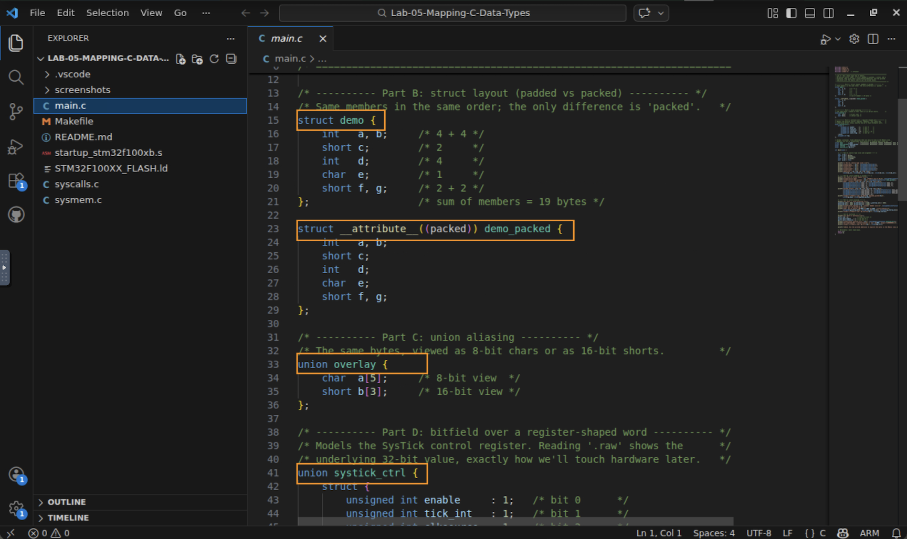
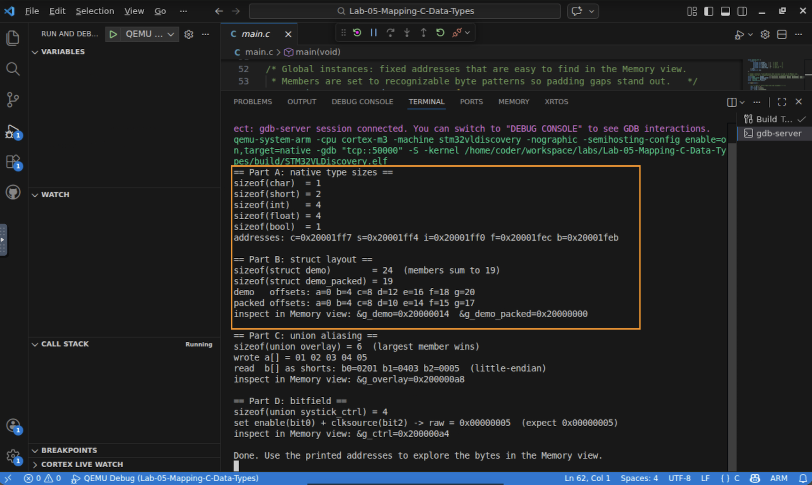
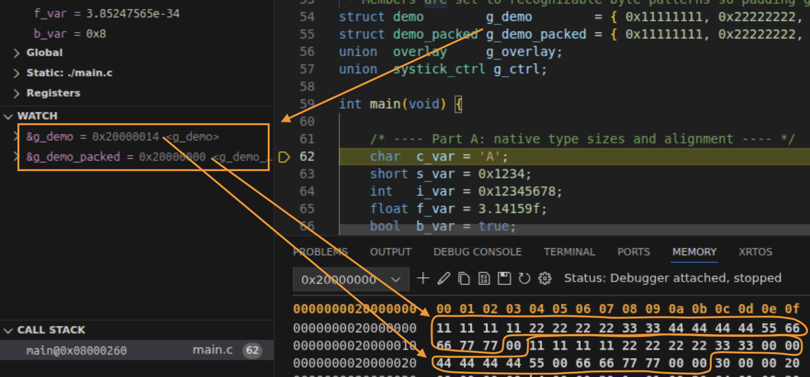
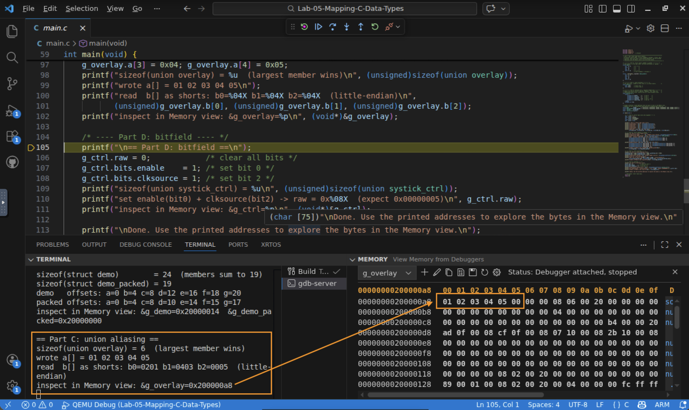
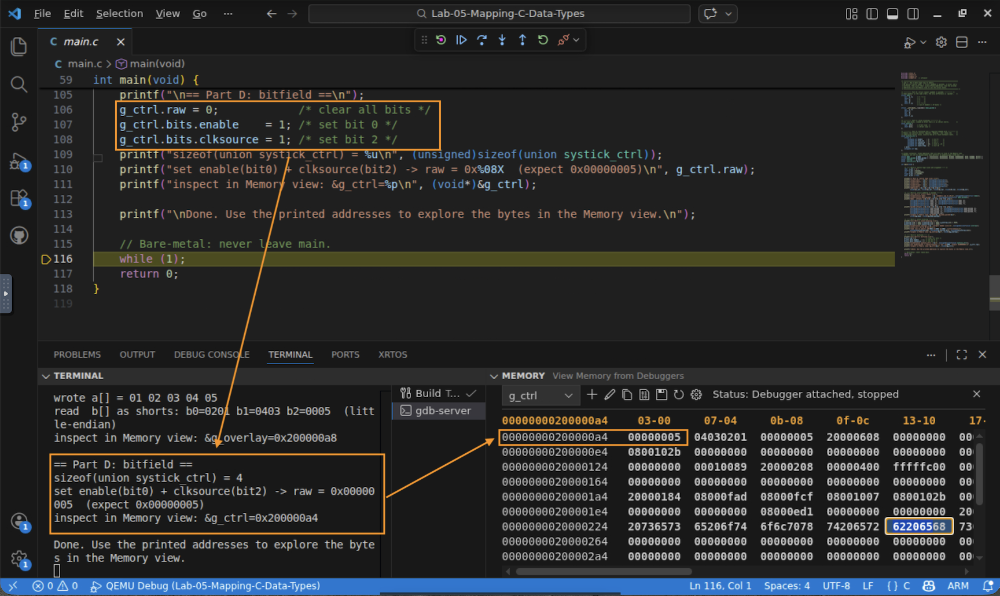

# Lab 5 — How C Data Types Map to Memory

## In this lab you will
- Confirm the sizes of C's native types (`char`, `short`, `int`, `float`, `bool`).
- See how the 32‑bit bus forces alignment and inserts padding.
- Watch a `struct` preserve declaration order (with padding) and control its layout by packing it.
- See a `union` reinterpret the same bytes as two different types.
- See a bitfield name individual bits of a register‑shaped word.

## Before you begin
- Prerequisites: watch the *Mapping C Data Types to Hardware* video, and complete Lab 4 (Variables, Registers, Memory view).
- The program prints a report over the serial terminal and also leaves labeled data in memory for you to inspect. The key idea: `sizeof` and member offsets are printed for you; the Memory view lets you see the actual bytes.
- ****Starter code:**** a single `main.c` that declares:
  | Thing | What it demonstrates |
  |-------|----------------------|
  | `char`/`short`/`int`/`float`/`bool` locals | native type sizes and alignment |
  | `struct demo` and `struct demo_packed` | padding vs packing (same members, one is `__attribute__((packed))`) |
  | `union overlay { char a[5]; short b[3]; }` | one region of memory, two type views |
  | `union systick_ctrl` (a bitfield) | naming individual bits of a 32‑bit word |

## Predict first
Before running anything, fill in your predictions:

| Question | Your prediction |
|----------|-----------------|
| `sizeof(char)`, `sizeof(short)`, `sizeof(int)` | ? / ? / ? |
| The `struct demo` members sum to 19 bytes. Will `sizeof(struct demo)` be more, equal, or less? | ? |
| Will the packed struct be larger or smaller than the normal one? | ? |

---

## Step 1 — Open the project and read the declarations
1. Open a terminal, `cd Lab-05-Mapping-C-Data-Types`, and run `code .`.
2. Skim `main.c`. Find the native locals, `struct demo` / `struct demo_packed`, the `union overlay`, and the `union systick_ctrl` bitfield. Notice the two structs have identical members and differ only by `packed`.

   

✅ Checkpoint: you can point to each of the four things in the table above.

## Step 2 — Build, run, and read the report
1. Build and start QEMU Debug. It halts at `main`.
2. Select the gdb‑server terminal (as in Lab 1) and click Continue (F5) so `main` runs and prints its report.
3. Read the serial output and check it against your predictions. You should see the native sizes (`1, 2, 4, 4, 1`), and that `sizeof(struct demo)` is larger than 19 while the packed struct is exactly 19.

   

✅ Checkpoint: the printed sizes match your predictions, and the struct is bigger than the sum of its members.

> 💡 The gap between `sizeof(struct demo)` and 19 is padding the compiler inserted to keep each member aligned on the 32‑bit bus.

## Step 3 — See padding vs packing in memory
Now look at the actual bytes. The report printed the addresses of `g_demo` and `g_demo_packed` (both near the base of RAM, e.g. around `0x20000000`).
1. Pause the debugger (or stay halted). Open a Memory view at the printed `&g_demo_packed` address. The members (`11111111 22222222 3333 44444444 55 6666 7777`) sit back to back, with no gaps: 19 bytes.
2. Open a Memory view at `&g_demo` (the normal struct). The same members appear, but now there are `00` padding gaps so that `d`, `f`, and the end land on aligned boundaries.

   

✅ Checkpoint: you can point to the padding bytes in `g_demo` that are absent in `g_demo_packed`.

## Step 4 — See a union alias the same bytes
1. Open a Memory view at the printed `&g_overlay` address. You'll see the five bytes you wrote through `a[]`: `01 02 03 04 05` (plus a trailing `00`, because `short b[3]` needs 6 bytes).
2. Compare to the report's `b[]` line: read as little‑endian shorts, those bytes become `b0=0x0201`, `b1=0x0403`, `b2=0x0005`. Same memory, two type views.

   

✅ Checkpoint: you can explain how `01 02` in memory becomes the short `0x0201`.

## Step 5 — See a bitfield name individual bits
1. The program set `enable` (bit 0) and `clksource` (bit 2) of `g_ctrl`, so its `raw` word is `0x00000005`.
2. Open a Memory view at the printed **`&g_ctrl`** address. As a little‑endian 32‑bit word you'll see `05 00 00 00`. Confirm `sizeof` is 4 bytes and only bits 0 and 2 are set.

   

✅ Checkpoint: you can map the bytes `05 00 00 00` to the bits `enable` and `clksource`. *(This is exactly how we'll model hardware registers in Part 3.)*

---

## Step 6 (extend, optional ~5 min) — Control layout by reordering
The compiler must keep struct members in the order you declare them, so a poor order wastes space on padding. You can reduce padding by ordering members from largest to smallest.
1. Stop the debugger. In `main.c`, reorder `struct demo`'s members to `int a, b, d;  short c, f, g;  char e;` (same members, larger types first).
2. Predict the new `sizeof`, then rebuild and rerun. You should see it drop (from 24 to about 20) with less padding, without any `packed` attribute.

✅ Checkpoint: by only reordering members, you reduced the struct's size. You **controlled** the layout.

## What just happened?
You confirmed, on real hardware, the rules from the video:
- Native types have fixed sizes, and the 32‑bit bus makes the compiler align them, inserting padding where needed.
- A `struct` preserves member order and pads to keep alignment; packing removes the padding (at the risk of unaligned access), and reordering members can reduce padding on its own.
- A `union` aliases one region of memory as different types.
- A bitfield lets you name and set individual bits of a word, the tool you'll use next to model hardware registers.

## Troubleshooting
| Symptom | Likely cause | Fix |
|--------|--------------|-----|
| No serial report | Wrong terminal, or you didn't press Continue | Select the gdb‑server terminal and click Continue |
| Memory view shows all `00` at a struct address | You inspected before `main` ran, or wrong address | Continue first, then use the exact `&g_...` address the program printed |
| `sizeof(struct demo)` is not 24 for you | You edited the struct (e.g., Step 6) | That's expected after reordering; restore the original order to get 24 |
| Bytes look "backwards" (e.g., `05 00 00 00`) | This is little‑endian byte order | The least significant byte is stored first; that's normal on this core |

## Check your understanding
1. Why is `sizeof(struct demo)` larger than the 19 bytes its members occupy?
2. What does `__attribute__((packed))` change, and what risk does it introduce?
3. In the union, why does writing `a[0]=0x01, a[1]=0x02` make `b[0]` read as `0x0201`?
4. If a bitfield sets only `enable` and `clksource`, what is the raw 32‑bit value, and why?

## Wrap-up
You can now predict and verify how any C type lays out in memory, and control a struct's layout by packing or reordering. Next you'll use exactly these tools, especially structs and bitfields, to build typed overlays for real hardware registers.