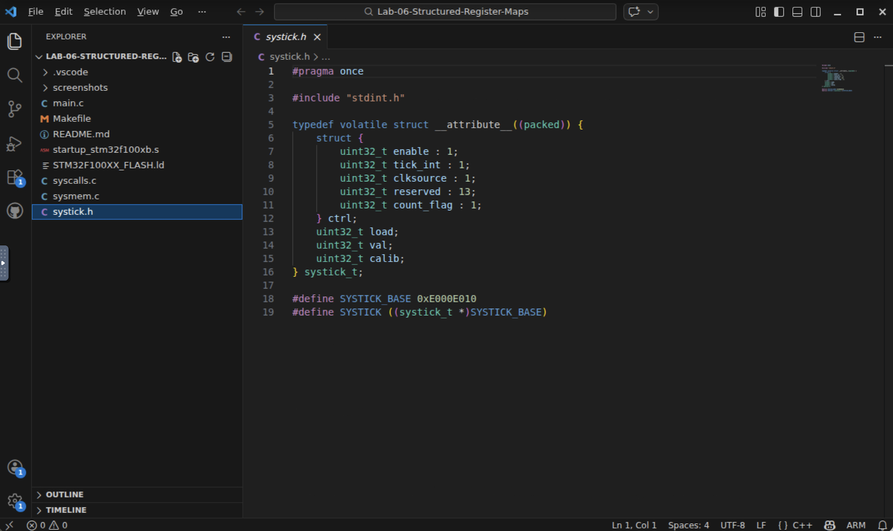
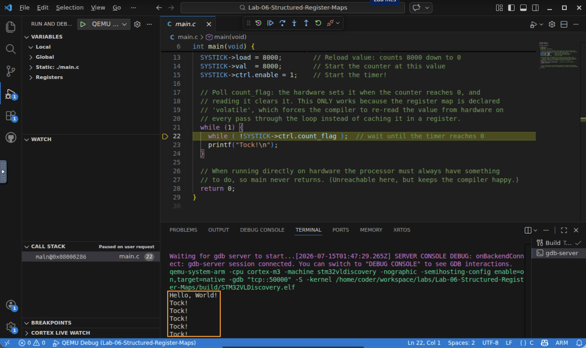
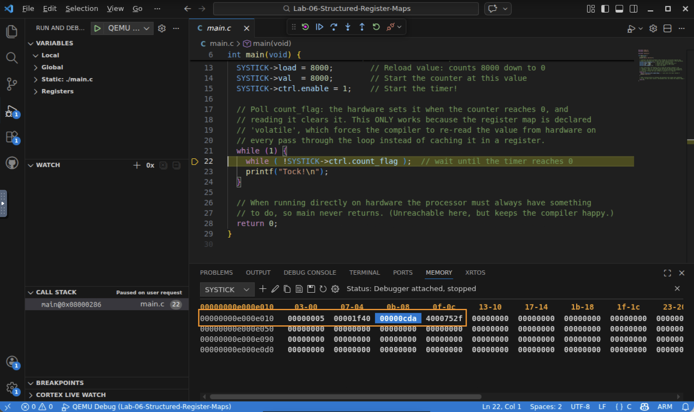
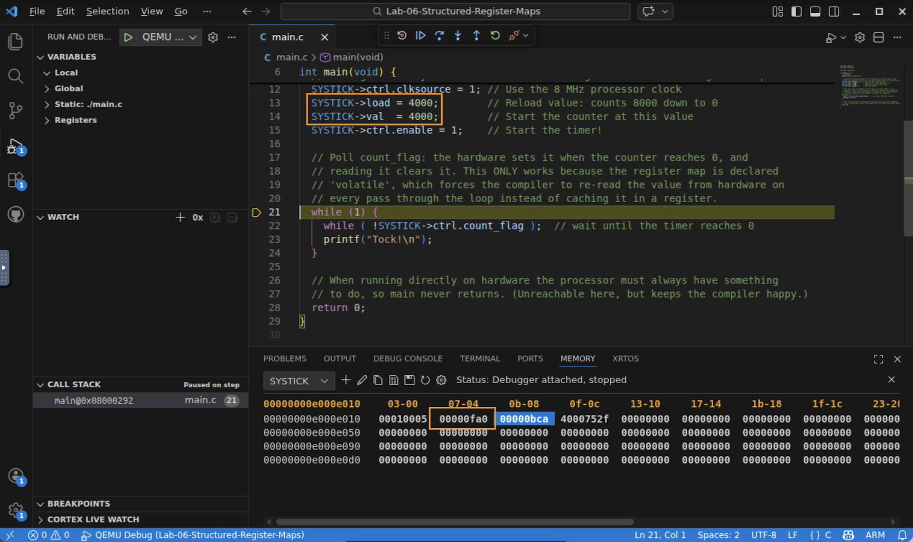

# Lab 6 — Structured Register Maps: Driving Real Hardware

## In this lab you will
- Read a structured register map (`systick.h`): a `typedef volatile struct __attribute__((packed))` that overlays the SysTick timer's registers.
- Understand why it must be `volatile` (hardware changes it behind the compiler's back), Lab-05-Mapping-C-Datatypes (must match the hardware layout exactly), and reached through a based pointer (`#define SYSTICK ((systick_t*)SYSTICK_BASE)`).
- Configure the timer by writing struct members, then poll a status bit to see `volatile` in action.
- Use the Memory view to confirm that `SYSTICK->load` and `SYSTICK->val` are literally the bytes at the peripheral's address.

## Before you begin
- Prerequisites: watch the *Typedefs, Structured Register Maps, and Pointer Dereferencing* video, and complete Lab 5 (structs, bitfields, packing) and Lab 4 (Memory/Registers views). This lab is the payoff: Lab 5's toolkit, pointed at real silicon.
- The SysTick registers live in the Cortex‑M core at base `0xE000E010`, four 32‑bit registers back to back:
  | Register | Address | Purpose |
  |----------|---------|---------|
  | `ctrl` | `0xE000E010` | control/status bitfield (enable, tick_int, clksource, count_flag) |
  | `load` | `0xE000E014` | value reloaded each time the counter hits 0 |
  | `val`  | `0xE000E018` | the live, counting‑down current value |
  | `calib`| `0xE000E01C` | calibration |
- Starter code: `systick.h` (the register map) and `main.c` (configures the timer and polls it). Nothing to write for the core lab.

## Step 1 — Read the register map (`systick.h`)
1. Open the lab (`cd Lab-06-Structured-Register-Maps`, `code .`) and open `systick.h`.
2. Notice three deliberate choices, each from a concept you've met:
   - `typedef ... systick_t` — names one type describing all four registers' layout (Lab 5's `typedef`).
   - `__attribute__((packed))` — no padding, so the struct matches the hardware's exact 4‑byte‑per‑register layout (Lab 5's packing).
   - `volatile` — every access re‑reads from hardware instead of caching in a register (the star of this lesson).
   - `#define SYSTICK ((systick_t *)SYSTICK_BASE)` — a pointer that places the struct at the peripheral's base address `0xE000E010`, so `SYSTICK->load` reaches the real register.

   

✅ Checkpoint: you can say what `volatile`, `packed`, and the pointer macro each do here.

## Step 2 — Read `main.c`
1. See how the timer is configured purely by writing struct members, readable C that maps one‑to‑one to register writes:
   ```c
   SYSTICK->ctrl.clksource = 1;  // pick the 8 MHz processor clock
   SYSTICK->load = 8000;         // reload value
   SYSTICK->val  = 8000;         // starting value
   SYSTICK->ctrl.enable = 1;     // start the timer
   ```
2. Then the loop polls the status bit: `while (!SYSTICK->ctrl.count_flag);` waits until the counter reaches 0, and printing `Tock!` each time. Reading `count_flag` auto‑clears it, so the next wait starts fresh.

✅ **Checkpoint:** you can explain how the loop knows the timer reached zero.

## Step 3 — Build and run
1. Build and start QEMU Debug (F5). Select the gdb‑server terminal and Continue.
2. Watch `Tock!` stream out. 

   

✅ Checkpoint: the timer you configured through a C struct is running real (emulated) hardware.

## Step 4 — Prove the struct *is* the hardware
This is the key idea: `SYSTICK->load` isn't a variable in RAM — it's the actual register at `0xE000E014`.
1. Pause the debugger. Open a Memory view at `0xE000E010`. You'll see the four registers. At `+4` (`0xE000E014`), `load` reads `0x00001F40` — that's 8000, the value your C wrote.
2. Add `SYSTICK->val` to a Watch. Pause, note the value; Continue briefly; pause again — `val` has counted down (or reloaded). It changes on its own because it's live hardware, which is exactly why the register map must be `volatile`.

   

✅ Checkpoint: you found `load` = `0x1F40` at `0xE000E014` and watched `val` change on its own.

> 💡 Why `volatile` matters (thought experiment). The compiler is allowed to read a normal variable once and reuse the value. If `count_flag` weren't `volatile`, the compiler could load it a single time before the `while` loop, and — since it read 0 — loop forever, never seeing the hardware set it. `volatile` forces a fresh load every pass. *(If you're curious and brave, you can test this later by removing `volatile` from `systick.h` and watching the program hang. Put it back afterward.)*

---

## Step 5 (extend) — Change the timer, watch the behavior change
1. Stop the debugger. In `main.c`, change both `SYSTICK->load` and `SYSTICK->val` from `8000` to `4000`.
2. Predict: will `Tock!` come faster or slower? Rebuild, run, and confirm the rate changes. Check the Memory view: `load` at `0xE000E014` now reads `0x00000FA0` (4000).

   

✅ Checkpoint: one struct write changed a hardware register and a visible behavior.

## What just happened?
You used the exact pattern professionals use for every peripheral:
- A `typedef`'d, packed, `volatile` struct models a peripheral's register layout in memory.
- A based pointer (`#define SYSTICK ((systick_t*)0xE000E010)`) places that model at the hardware's real address.
- Dereferencing it (`SYSTICK->load = 8000`) reads and writes actual registers with readable, type‑safe C.
- `volatile` guarantees the generated machine code re‑reads hardware every time, so you never miss a change the hardware makes.

The result is clean C that drives real hardware. You'll reuse this pattern for the USART and other peripherals in the coming modules.

## Troubleshooting
| Symptom | Likely cause | Fix |
|--------|--------------|-----|
| No `Tock!` output | Wrong terminal, or didn't Continue | Select the gdb‑server terminal, press Continue |
| Memory view at `0xE000E010` is all zeros | You inspected before `main` configured the timer | Continue past the configuration lines, then pause and look |
| `load` doesn't read `0x1F40` | You edited the reload value (Step 5) | That's expected; `0xFA0` = 4000. Restore `8000` for the original |
| Program never prints after config | `volatile` was removed from `systick.h` | Restore `volatile` so `count_flag` is re‑read each loop |

## Check your understanding
1. Why must the register‑map struct be `packed`?
2. What would go wrong if `count_flag` were *not* `volatile`?
3. What does `SYSTICK->load = 8000;` actually do at the hardware level?
4. `SYSTICK->val` changes even when your code isn't writing it. Why?

## Wrap-up
You can now model any memory‑mapped peripheral with a `volatile` packed struct and a based pointer, and drive it with readable C. Next, you'll let the timer *interrupt* the processor instead of polling — and deal with the data‑sharing (concurrency) issues that introduces.