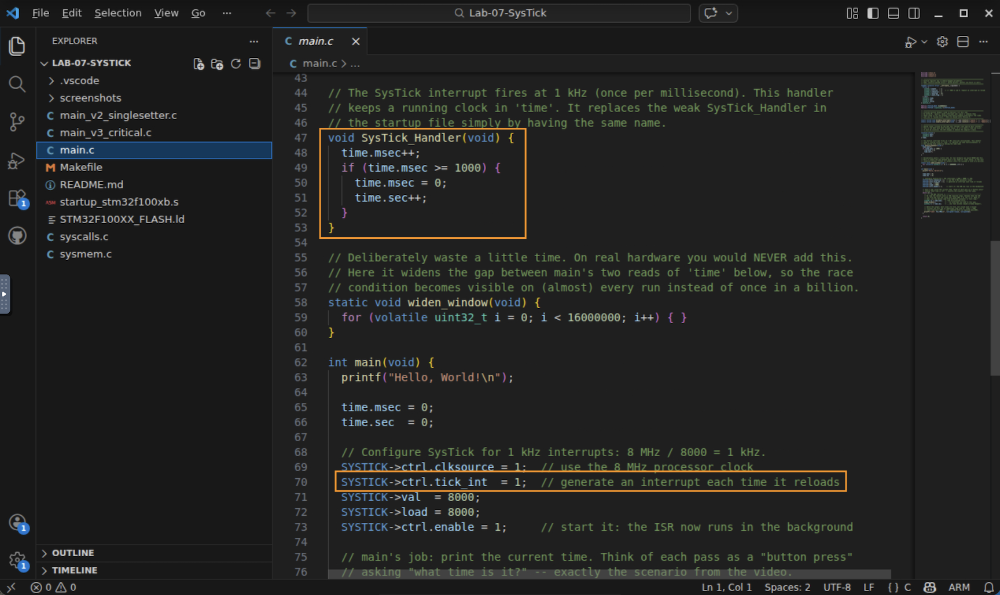
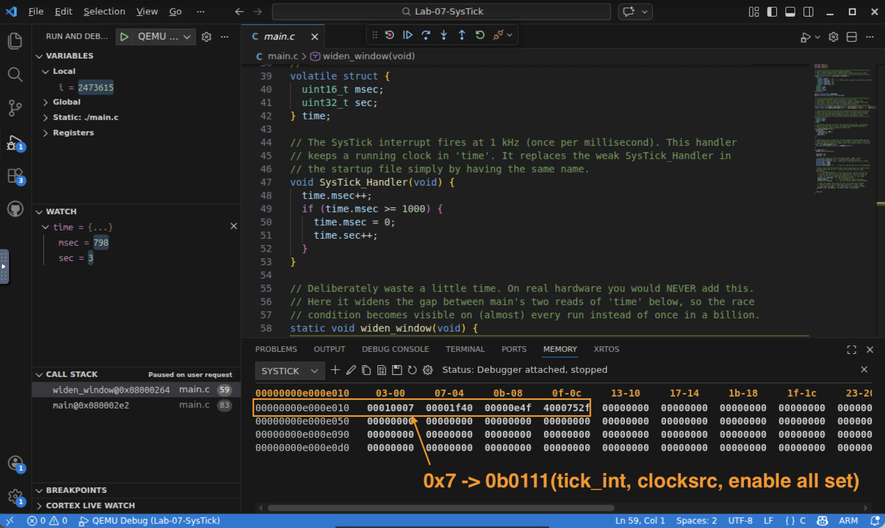
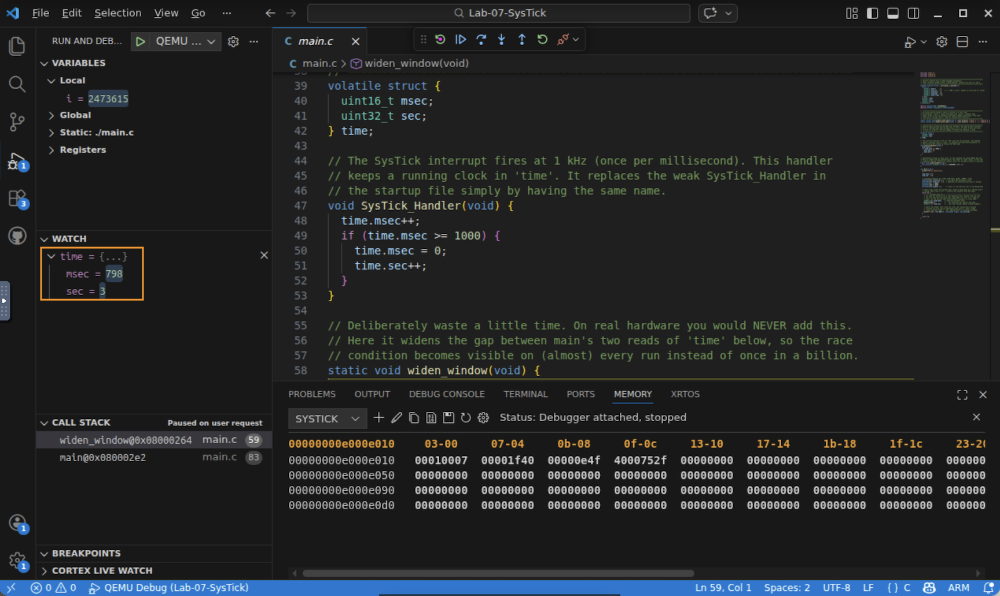
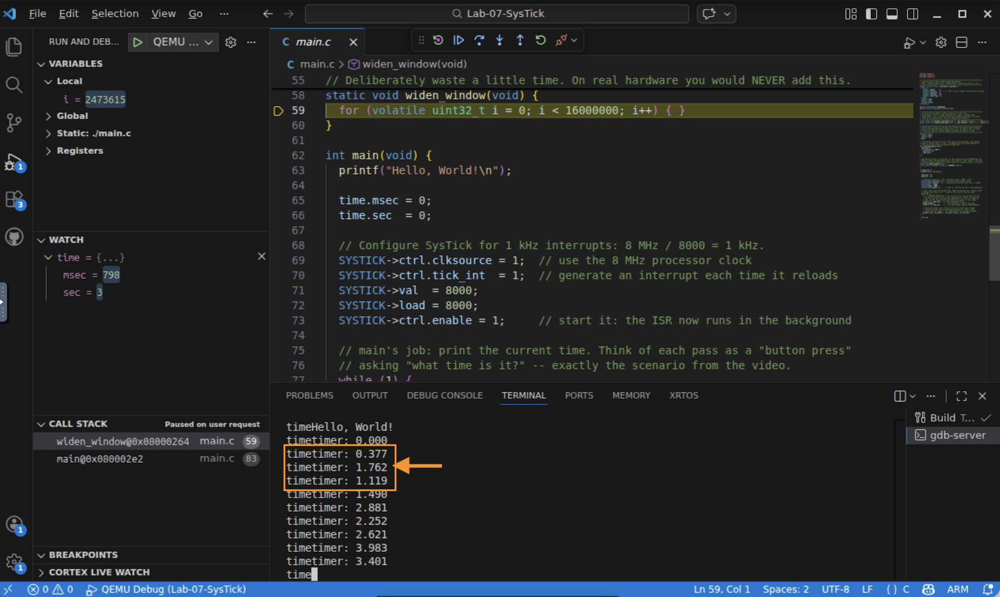
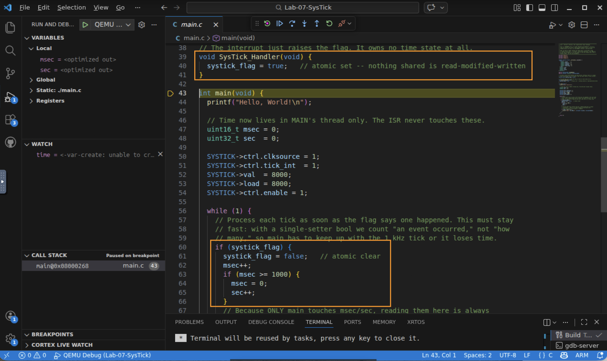
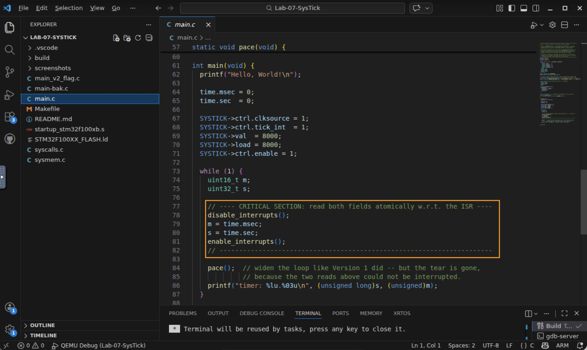

# Lab 7 — SysTick Interrupts and Data Concurrency

## In this lab you will
- Upgrade the SysTick timer from polling (Lab 6) to interrupt-driven: the timer now calls a handler in the background while `main` does other work.
- Watch two "threads" — the `SysTick_Handler` interrupt and `main` — share one piece of data, and see a race condition corrupt a reading.
- Fix the race two ways from the video: a single-setter flag and a critical section, and weigh the trade-offs.

## Before you begin
- Prerequisites: watch the *Data Concurrency* video, and complete Lab 6 (the SysTick register map and `volatile`). This lab reuses that exact register map and adds one new bit: `tick_int`.
- Two ideas from the video drive everything here:
  - Atomic access — an operation that cannot be split or interrupted. A single 32-bit store (like `flag = true;`) is atomic; a `counter++` (load, add, store) is not.
  - Race condition — behavior that depends on uncontrollable timing, such as *exactly when* an interrupt lands relative to your code.
- Starter code: `main.c` ships as *Version 1*, which deliberately exposes the race. You will evolve it into Version 2 and Version 3. Two reference files, `main_v2_singlesetter.c` and `main_v3_critical.c`, hold the finished fixes so you can check your work. (They are not compiled by the build.)

> 🖥️ A note on timing. `main.c` contains a `widen_window()` delay loop with a large iteration count. It exists only to make the race visible on almost every run. On real hardware you would never add it... the race window would be a few nanoseconds and the bug would strike maybe once in billions of reads, which is exactly what makes real concurrency bugs so hard to catch.

## Step 1 — Read `main.c`: from polling to interrupts
1. Open the lab (`cd Lab-07-SysTick`, `code .`) and open `main.c`.
2. Compare it to Lab 6. The register map is identical, but note the upgrade:
   - `SYSTICK->ctrl.tick_int = 1;` — new. This tells SysTick to raise an interrupt every time it reaches zero, instead of just setting a flag for us to poll.
   - `void SysTick_Handler(void) { … }` — this function runs automatically on every timer interrupt. Its name matters: it replaces the placeholder handler in `startup_stm32f100xb.s`. The processor drops whatever `main` is doing, runs this, then returns.
   - After `main` starts the timer, its `while(1)` loop no longer polls — the timer keeps time in the background. This is *interrupt-driven* design.

   

✅ Checkpoint: you can point to the two things that make this interrupt-driven: `tick_int = 1` and the `SysTick_Handler` function.

## Step 2 — Build, run, and notice something is wrong
1. Build and start QEMU Debug (F5). Select the gdb-server terminal and Continue.
2. The program prints the running time, `timer: <sec>.<msec>`, over and over. Let it scroll for a few seconds.
3. Most lines climb smoothly… but every second or so, one line is impossible. Watch for a value like `timer: 1.964` appearing right between `0.9xx` and `1.0xx` lines.  The seconds count jumps a whole second too early, then the next line snaps back.

✅ Checkpoint: you spotted at least one line where the time reading is obviously wrong.

## Step 3 — Prove the interrupt really runs in the background
Before we explain the bug, confirm the ISR is firing on its own.
1. The interrupt is armed. Pause the debugger. Open a Memory view at `0xE000E010` (the SysTick `ctrl` register). Bit 1 (`tick_int`) is set — that is what turns timer reloads into interrupts. *(Use the Memory view for peripheral registers; a Watch expression on a hardware register does not work reliably in this debugger.)*

   

2. The ISR is updating `time` while `main` is paused. Add `time` to a Watch (it is an ordinary RAM variable, so Watch works here). Set a breakpoint inside `main`'s loop, or just pause and resume a few times: `time.sec` / `time.msec` keep advancing even though you never step the ISR. It runs itself, on the timer interrupt.

   

✅ Checkpoint: you confirmed the timer interrupt is armed (`tick_int`) and that `SysTick_Handler` updates `time` without `main`'s help.

## Step 4 — Understand the race condition
Now the bug. Look at how `main` reads the clock:
```c
uint16_t m = time.msec;   // read milliseconds first...
widen_window();           // ...an interrupt can land in this gap...
uint32_t s = time.sec;    // ...now read seconds (maybe already bumped!).
printf("timer: %lu.%03u\n", (unsigned long)s, (unsigned)m);
```
`main` reads the shared clock in two separate steps. Picture the timer at `0.999` (`sec = 0`, `msec = 999`):
1. `main` reads `m = time.msec` → 999.
2. During `widen_window()`, the SysTick interrupt fires and rolls the clock over: `msec` → 0, `sec` → 1.
3. `main` reads `s = time.sec` → 1.
4. It prints `1.999` — a time that never existed. The real time was `0.999`; `main` stitched together the old milliseconds and the new seconds.

This is a race condition: two threads (the ISR and `main`) touched the same data, and the outcome depended on the uncontrollable timing of the interrupt. The reads of `sec` and `msec` were not atomic as a pair.

   
   
✅ Checkpoint: you can explain, in terms of the interrupt landing between two reads, why `main` prints a time that never happened.

---

## Step 5 (extend) — Fix #1: the single-setter flag
The cleanest fix for simple cases: stop sharing mutable numbers. Let the ISR only set a flag (one atomic store), and let `main` own *all* the time-keeping in its own thread.

1. Stop the debugger. Open `main_v2_singlesetter.c` and read it. The key changes:
   - The ISR shrinks to one line: `systick_flag = true;`, an atomic write, nothing shared is read-modified-written.
   - `msec` and `sec` become local variables in `main`. Only `main` touches them, so there is no second thread to race with.
2. Apply it: back up `main.c`, then copy `main_v2_singlesetter.c` over `main.c` (or edit `main.c` to match). Rebuild and run.
3. The output climbs cleanly through every second boundary.  There are no torn readings.

   
   *Setup (author): QEMU serial output from the Version 2 build, showing clean `timer:` lines crossing a second boundary (…0.750, 1.000, …) with no glitch.*

✅ Checkpoint: with the single-setter flag, the shared numeric state is gone and the race cannot occur. Think about *why* moving `msec`/`sec` into `main` removes the race (the video leaves this to you).

## Step 6 (extend) — Fix #2: the critical section
Sometimes you truly need shared data. Then make the risky access uninterruptible: briefly disable interrupts, read both fields, re-enable.

1. Open `main_v3_critical.c`. The shared `time` struct and the time-keeping ISR are back, identical to Version 1, but `main`'s read is wrapped:
   ```c
   disable_interrupts();   // cpsid i
   m = time.msec;
   s = time.sec;           // the ISR cannot fire between these two reads
   enable_interrupts();    // cpsie i
   ```
   `disable_interrupts()` / `enable_interrupts()` are the `cpsid i` / `cpsie i` instructions made available as C function calls. The two reads now happen as one indivisible unit with respect to the timer.
2. Apply it: copy `main_v3_critical.c` over `main.c`, rebuild, and run. The `widen_window()`-style delay is still there, yet the timing glitch is gone.  The interrupt can no longer slip between the two reads.

   
   
3. Trade-off. A critical section blocks *every* interrupt while it runs, so keep it as short as possible — notice the slow `printf` happens after `enable_interrupts()`, never inside. The single-setter flag (Fix #1) avoids disabling interrupts at all, which is why it is preferred when it fits.

✅ Checkpoint: you can state when you would reach for a critical section instead of a single-setter flag, and why the `printf` stays outside it.

## What just happened?
- Interrupts let a peripheral run code in the background — powerful, but now two "threads" can touch the same data.
- Reading `sec` and `msec` separately was not atomic, so a well-timed interrupt produced a torn read: a race condition.
- Single-setter flag: the ISR sets one atomic flag; one thread owns the data. Simple and cheap — the go-to for basic cases.
- Critical section: disable/enable interrupts around the shared access to make it atomic. More general, but blocks all interrupts, so keep it short.
- The real lesson: any time two execution threads touch shared data, stop and think about concurrency before it becomes a mysterious, once-in-a-billion bug on real hardware.

## Troubleshooting
| Symptom | Likely cause | Fix |
|--------|--------------|-----|
| No output at all | Wrong terminal, or didn't Continue | Select the gdb-server terminal, press Continue |
| Never see a torn line (Version 1) | Watched too briefly | Let it run 5–10 seconds; the tear appears about once per second, near each rollover |
| Program prints once then stops | `SysTick_Handler` not firing | Confirm `tick_int` and `enable` are set in the Memory view at `0xE000E010` |
| Version 2 time runs too slowly | `main` can't keep up with 1 kHz | Keep the flag-check loop tight; don't add delays between ticks (a single-setter flag counts *events happened*, not *how many*) |
| Still see tears after "fixing" it | Edited the wrong copy, or old build cached | Save `main.c`, run the build task again (or `make clean` then rebuild) |

## Check your understanding
1. What makes `flag = true;` atomic but `counter++;` not?
2. In Version 1, exactly which two machine-level events must overlap in time to produce a torn read?
3. Why does moving `msec` and `sec` into `main` (Version 2) eliminate the race entirely?
4. Why must the `printf` in Version 3 be placed *after* `enable_interrupts()`?

## Wrap-up
You moved from polling to interrupt-driven timing, met the concurrency bug that background execution creates, and fixed it two standard ways. Next module you'll keep building on interrupts and pointers — and in the final module you'll refactor this kind of `main.c` into reusable driver modules and event callbacks.
