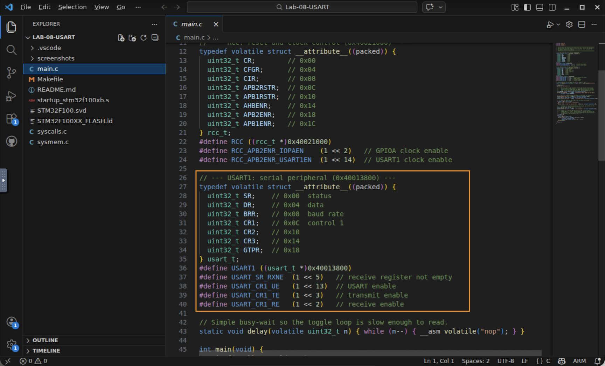
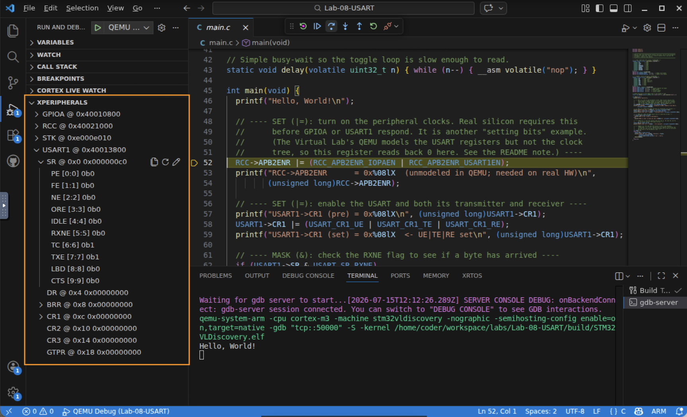
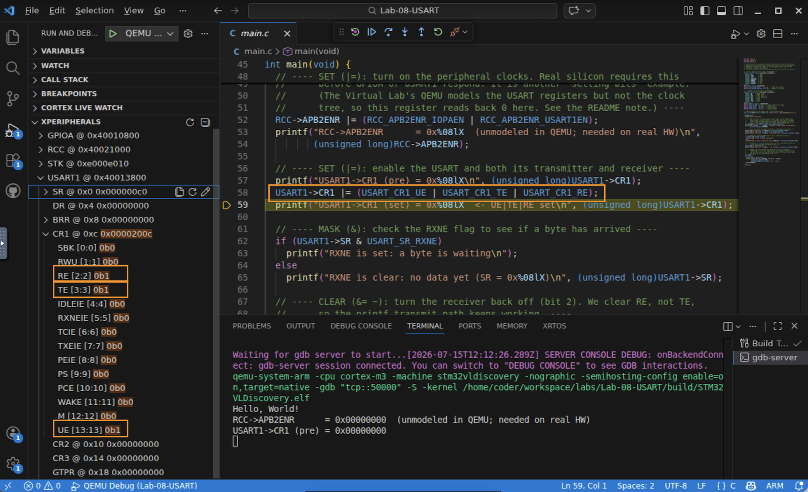
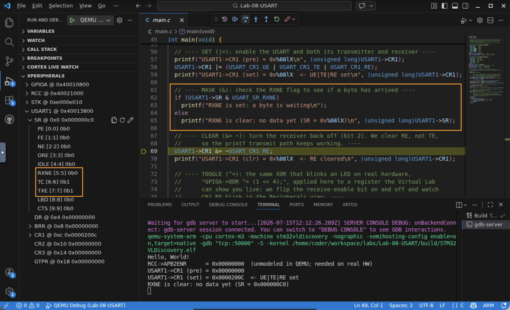
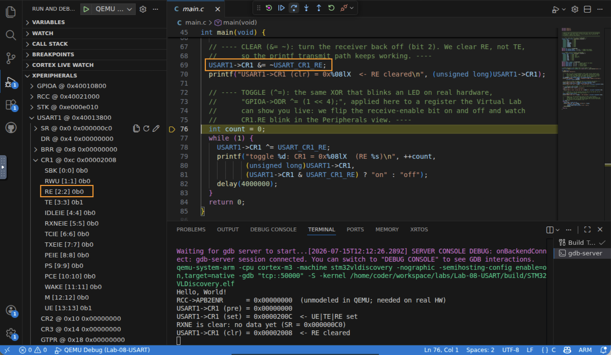
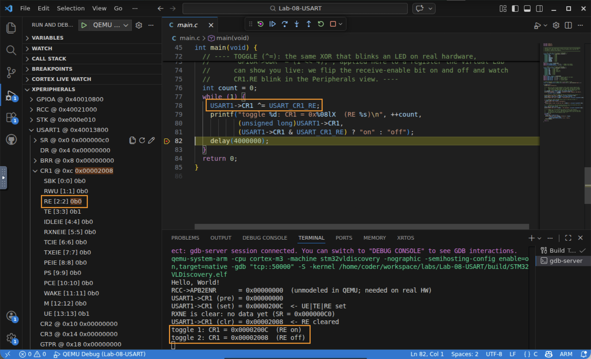

# Lab 8 — Bit Manipulation on Hardware Registers

## In this lab you will
- Configure a real peripheral (the USART) using nothing but C's bitwise operators, the four moves you saw in the video: mask, set, clear, toggle.
- Monitor named peripheral registers and individual bits live in the debugger's Cortex Peripherals view, so you watch `CR1.UE`, `CR1.TE`, `CR1.RE` change by name instead of decoding hex.
- Connect each C operator to the exact bit it moves, and revisit why a read‑modify‑write toggle is not atomic.

## Before you begin
- Prerequisites: watch the two Part 1 videos (*C Bitwise Operators* and *Bitwise Operations on Hardware Registers*), and complete Lab 6 (the based‑pointer register‑map pattern this lab reuses).
- The four register operations, and the operator each one uses:
  | Operation | Operator | Example | Effect |
  |-----------|----------|---------|--------|
  | **Mask** (test a bit) | `&` | `if (USART1->SR & USART_SR_RXNE)` | isolate one bit to read it |
  | **Set** (0 → 1) | `\|=` | `USART1->CR1 \|= USART_CR1_UE` | turn bits on, leave others alone |
  | **Clear** (1 → 0) | `&= ~` | `USART1->CR1 &= ~USART_CR1_RE` | turn bits off, leave others alone |
  | **Toggle** (flip) | `^=` | `GPIOA->ODR ^= STATUS_LED_BIT` | invert bits, leave others alone |
- New tool this lab: the Cortex Peripherals view. A System View Description (`.svd`) file names every register and bitfield for the chip. With `"svdFile"` set in `launch.json`, cortex-debug shows a Peripherals tree in the Run and Debug sidebar. Expand `USART1 → CR1` and you see `UE`, `TE`, `RE` as named bits with live values. This is the right way to watch peripheral registers. The Memory view still works as a fallback.
- Starter code: a single `main.c`. Nothing to write for the core lab; you run it and watch the bits move.

> 🧪 **Emulator note.** The Virtual Lab's QEMU models the USART registers precisely, so everything you watch on `USART1` is real. The emulator does not model the clock tree (`RCC`) or the GPIO port, so those registers read back `0` here. That is why this lab does its live work on the USART, and treats the GPIO LED and the `RCC` clock enable as "on real hardware" steps. Seeing `RCC->APB2ENR = 0x00000000` in the output is expected, and is a good reminder that an emulator is a *model* of the silicon, not the silicon itself.

## Step 1 — Read the register maps and bit masks
1. Open the lab (`cd Lab-08-USART`, `code .`) and open `main.c`.
2. Notice the three register maps (`RCC`, `USART1`, and, for the real‑hardware aside, the LED lives on `GPIOA`) built with the same `volatile packed struct` + based‑pointer pattern from Lab 6.
3. Notice how each bit is named with a shift constant, straight from the slides:
   ```c
   #define USART_SR_RXNE (1 << 5)    // receive-not-empty flag
   #define USART_CR1_UE  (1 << 13)   // USART enable
   #define USART_CR1_TE  (1 << 3)    // transmit enable
   #define USART_CR1_RE  (1 << 2)    // receive enable
   ```

   

✅ Checkpoint: you can read `(1 << 13)` and say "that is a mask with a single 1 in bit position 13."

## Step 2 — Build, run, and open the Peripherals view
1. Start QEMU Debug (F5). In the Run and Debug sidebar, find the Cortex Peripherals section and expand it. You should see `USART1`, `RCC`, `GPIOA`, and `STK` (SysTick), decoded from the SVD file.
2. Select the gdb-server terminal and Continue. The program prints each register value as it changes.

   

✅ Checkpoint: the Peripherals view lists the chip's peripherals by name.

## Step 3 — SET: enable the USART (`|=`)
1. The code turns the USART on and enables both its transmitter and receiver in one write:
   ```c
   USART1->CR1 |= (USART_CR1_UE | USART_CR1_TE | USART_CR1_RE);
   ```
   The three masks OR together into one value with 1s in bits 13, 3, and 2; `|=` sets exactly those bits and leaves the rest untouched.
2. In the Peripherals view, expand `USART1 → CR1`. After this line, `UE`, `TE`, and `RE` all read `1`, and the register value is `0x0000200C`. The serial output confirms: `USART1->CR1 (set) = 0x0000200C`.

   

✅ Checkpoint: one `|=` set three named bits at once, and you can see them as `1` in the Peripherals view.

## Step 4 — MASK: check the RXNE flag (`&`)
1. To ask "has a byte arrived?", the code isolates one bit:
   ```c
   if (USART1->SR & USART_SR_RXNE) { /* read the data */ }
   ```
   ANDing `SR` with a value that is all zeros except bit 5 keeps only the RXNE bit; everything else masks to 0.
2. With no input arriving, RXNE is 0, so the mask evaluates false. Expand `USART1 → SR` and you will see `RXNE = 0` (and `TXE`/`TC = 1`, the transmitter's idle state). The output reads `RXNE is clear: no data yet (SR = 0x000000C0)`.

   

✅ Checkpoint: you used `&` to isolate a single status bit and read it as a true/false condition.

## Step 5 — CLEAR: turn the receiver back off (`&= ~`)
1. To switch one bit off without disturbing the others, mask with its inverse:
   ```c
   USART1->CR1 &= ~USART_CR1_RE;
   ```
   `~USART_CR1_RE` is all 1s except a 0 in bit 2; ANDing forces bit 2 to 0 and preserves the rest.
2. `CR1` now reads `0x00002008`: in the Peripherals view `RE` drops to `0`, while `UE` and `TE` stay `1`. (We clear `RE`, not `TE`, so `printf` keeps transmitting.)

   

✅ Checkpoint: `&= ~mask` cleared exactly one bit and left the neighbors alone.

## Step 6 — TOGGLE: flip a bit every pass (`^=`)
1. The loop flips the receive‑enable bit on and off with exclusive‑or:
   ```c
   USART1->CR1 ^= USART_CR1_RE;   // same XOR that blinks an LED on real hardware
   ```
   XOR with a single‑bit mask inverts that bit each time and leaves the rest unchanged.
2. Watch `CR1` alternate `0x0000200C` (RE on) and `0x00002008` (RE off) in the serial output, and watch the `RE` bit blink `1 ↔ 0` in the Peripherals view.

   

✅ Checkpoint: a single `^=` toggles one bit cleanly, over and over.

---

## On real hardware 
The video's toggle example blinks an LED. On the real STM32VLDISCOVERY board that is:
```c
RCC->APB2ENR |= RCC_APB2ENR_IOPAEN;   // (SET) enable the GPIOA clock first
GPIOA->ODR   ^= STATUS_LED_BIT;        // (TOGGLE) flip the LED pin, bit 4
```
Same four operators, a different register. The Virtual Lab's QEMU doesn't wire GPIO to a visible LED (its `ODR` reads back `0`), which is why we watched the identical toggle technique on `USART1->CR1` instead.

Concurrency reminder (Module 2 returns). A toggle is a *read‑modify‑write*: `ldr` the register, `eor` the bit, `str` it back. It is *not atomic* — if an interrupt changes the same register between the load and the store, your store overwrites its change. When you toggle a shared register with interrupts enabled, think about this. Some peripherals offer atomic help: GPIO's `BSRR` (bit set/reset register) sets or clears bits in a single write with no read, avoiding the hazard (see Reference Manual 7.2.5).

## Troubleshooting
| Symptom | Likely cause | Fix |
|--------|--------------|-----|
| `RCC->APB2ENR` prints `0x00000000` | QEMU doesn't model RCC | Expected. It is a real‑hardware step; the USART registers still behave correctly |
| `GPIOA->ODR` never changes | QEMU doesn't model GPIO | Expected in the Virtual Lab. Watch the toggle on `USART1->CR1` instead |
| No serial output | Wrong terminal, or didn't Continue | Select the gdb-server terminal and press Continue |

## Check your understanding
1. What single value does `(USART_CR1_UE | USART_CR1_TE | USART_CR1_RE)` produce, in hex?
2. Why does `CR1 &= ~USART_CR1_RE` leave `UE` and `TE` untouched?
3. You want to test whether the transmitter is empty (`TXE`, bit 7). Write the `if` condition.
4. Why is `GPIOA->ODR ^= STATUS_LED_BIT` not an atomic operation, and when does that matter?

## Wrap-up
You configured a real peripheral with the four bitwise register operations and watched named bits change live in the SVD Peripherals view. These operators are how almost all bare‑metal C touches hardware. Next you'll look at how C types and casts affect what actually gets read from and written to these same USART registers.
