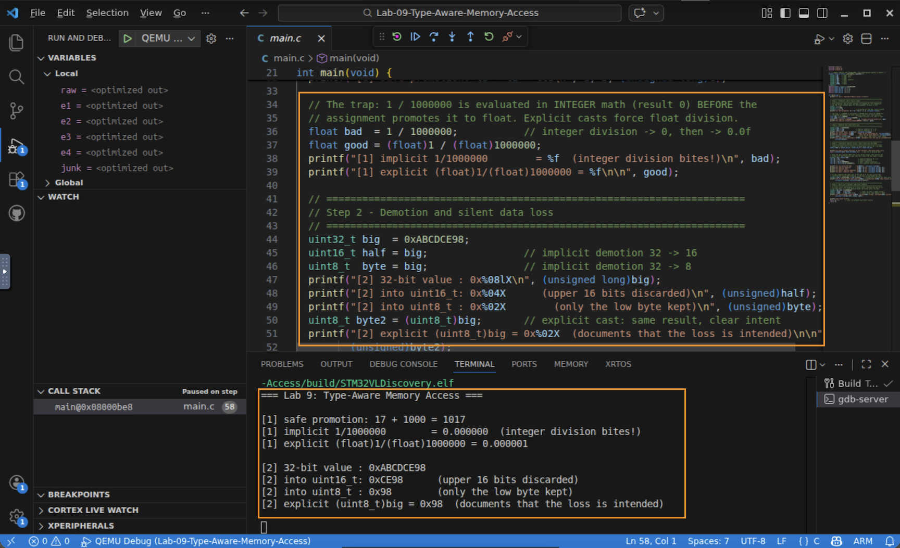
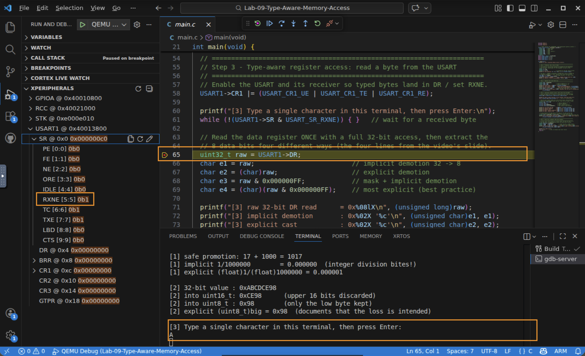
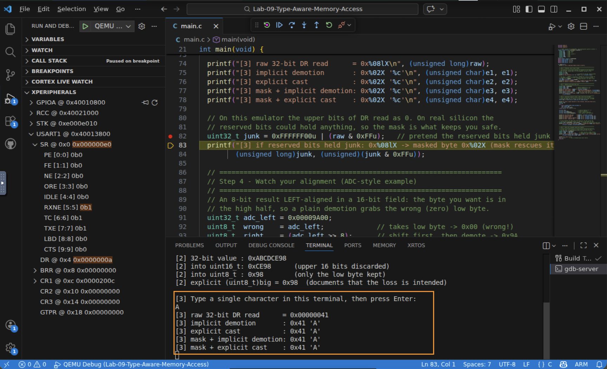
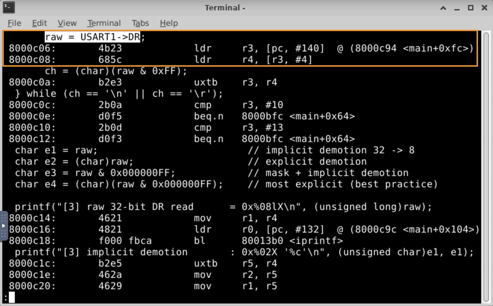

# Lab 9 — Type-Aware Memory Access

## In this lab you will
- See how C's type promotion and demotion happen automatically, and where the implicit rules bite you.
- Read a real byte from the USART data register and extract it four different ways, from careless to careful, the way the video shows.
- Learn to write type-aware C for hardware: matching C types to register access widths, and watching for data alignment.

## Before you begin
- Prerequisites: watch the two Part 2 videos (*Explicit and Implicit Type Casting* and *Type-Based Memory Access*), and complete Lab 8 (bitwise register work; this lab reuses the USART map and the SVD Peripherals view).
- The ideas in one table:
  | Term | Meaning | Watch out for |
  |------|---------|---------------|
  | **Promotion** | a narrower type widened to a wider one | safe for values, but *when* it happens can surprise you |
  | **Demotion** | a wider type narrowed to a smaller one | silently discards the upper bits |
  | **Type-aware access** | choosing C types/casts so reads and writes match the hardware | wrong width can read junk, or even fault |
- This lab is interactive: in Step 3 you type a character into the gdb-server terminal and the program reads it from the USART.
- Starter code: a single `main.c`. Nothing to write for the core lab; run it and read the output.

## Step 1 — Promotion, and a trap it hides
1. Safe promotion widens operands with no data loss. `uint8_t + uint16_t` is computed as `uint16_t`, then stored into a `uint32_t`:
   ```c
   uint32_t c = a + b;   // 17 + 1000 = 1017, nothing lost
   ```
2. The trap: in `float bad = 1 / 1000000;`, the division runs in integer math *first* (giving 0), and only then is the 0 promoted to `float`. The output shows it:
   ```
   [1] implicit 1/1000000        = 0.000000  (integer division bites!)
   [1] explicit (float)1/(float)1000000 = 0.000001
   ```
   Casting an operand to `float` before the division fixes it.

   

✅ Checkpoint: you can explain why `1 / 1000000` becomes `0.0` even though it is assigned to a float.

## Step 2 — Demotion and silent data loss
1. Assigning a wide value to a narrow type throws away the upper bits, with no warning:
   ```c
   uint32_t big  = 0xABCDCE98;
   uint16_t half = big;   // -> 0xCE98
   uint8_t  byte = big;   // -> 0x98
   ```
   The output confirms `0xABCDCE98` becomes `0xCE98` then `0x98`.
2. `(uint8_t)big` produces the same `0x98`, but the explicit cast documents that the loss is intended, so a future reader knows it was not an accident.

✅ Checkpoint: you can predict what `0xABCDCE98` becomes when demoted to 16 and 8 bits, and say why an explicit cast is good style.

## Step 3 — Type-aware register access: read a byte from the USART
This is the heart of the lab.
1. The code first enables the USART and its receiver so typed bytes arrive:
   ```c
   USART1->CR1 |= (USART_CR1_UE | USART_CR1_TE | USART_CR1_RE);
   ```
2. It then waits for a byte. *Type a character in the terminal and press Enter.* The terminal is line-buffered (canonical mode), so a single keystroke is **not** delivered until you press Enter, and Enter itself sends a newline. The code handles this by reading bytes and skipping the `\r`/`\n` from Enter, so it captures the character you typed, not `0x0A`. Watch `USART1 → SR → RXNE` flip to `1` in the Peripherals view the moment your byte arrives.

   

3. The data register is read once as a full 32-bit value, then the 8 data bits are extracted four ways, careless to careful:
   ```c
   uint32_t raw;  char ch;
   do {                                 // read until a real char, skipping Enter's newline
     while (!(USART1->SR & USART_SR_RXNE)) { }
     raw = USART1->DR;                  // 32-bit read of the data register
     ch  = (char)(raw & 0xFF);
   } while (ch == '\n' || ch == '\r');
   char e1 = raw;                       // implicit demotion 32 -> 8
   char e2 = (char)raw;                 // explicit demotion
   char e3 = raw & 0x000000FF;          // mask + implicit demotion
   char e4 = (char)(raw & 0x000000FF);  // most explicit (best practice)
   ```
   For a clean input byte all four agree. If you typed `A`, every line reads `0x41 'A'`.

   

4. Why bother masking, if a plain assignment already works? Because on real hardware the *reserved upper bits could hold anything*. The last `[3]` line simulates junk in those bits (`0xFFFFFF41`) and shows the mask still recovers the byte (`0x41`). In this emulator the upper bits happen to read `0`, so the plain demotion looks fine here, but the masked, cast version is the habit that keeps you safe on silicon.

✅ Checkpoint: you read a live byte from a 32-bit register and extracted the data with an explicit mask and cast.

---

## Step 4 (extend) — Watch your alignment
Not every register puts your data in the low bits. An 8-bit result that is left-aligned in a 16-bit field lives in the high byte:
```c
uint32_t adc_left = 0x00009A00;   // 0x9A left-aligned
uint8_t  wrong = adc_left;        // 0x00  <- grabbed the wrong byte
uint8_t  right = (adc_left >> 8); // 0x9A  <- shift first, then demote
```
The output shows `naive=0x00 (wrong), shifted=0x9A (correct)`. Always check your reference manual for left vs right alignment (analog-to-digital converters are notorious for this).

## Under the hood: C types become access-width instructions
The width of a C access is not just cosmetic. On the Cortex-M, your type picks the load/store instruction:

| C type | Instruction | Access width |
|--------|-------------|--------------|
| `uint8_t`  | `LDRB` / `STRB` | 8-bit |
| `uint16_t` | `LDRH` / `STRH` | 16-bit |
| `uint32_t` | `LDR` / `STR`   | 32-bit |

You can prove it by disassembling the lab. Because it is built with debug info (`-g`), use the `-S` option to interleave your C source with the instructions it compiled to (the same tool from Module 2):
```
arm-none-eabi-objdump -S build/STM32VLDiscovery.elf | less
```
Search for `main` and find the register read. You will see the C line sitting right above the instruction it became:
```
    raw = USART1->DR;
 8000c06:   ldr   r3, [pc, #140]
 8000c08:   ldr   r4, [r3, #4]     @ a full-word LDR: a 32-bit access of DR
```
Because `DR` is declared `uint32_t`, the read is a full-word `LDR`. This is why peripheral register maps use `uint32_t` fields: many registers only tolerate 32-bit access, and a narrower type could produce a `LDRH`/`LDRB` that reads reserved space and faults. (Nearby you can also spot the `CR1 |= …` line become an `ldr / orr / str` read-modify-write.)

   

## Troubleshooting
| Symptom | Likely cause | Fix |
|--------|--------------|-----|
| Program stops at "Type one character" and never continues | No byte received yet | Click into the gdb-server terminal, type a character, then press Enter |
| You typed a character but the value read is `0x0A` | Read the newline from Enter instead of the character | Fixed in this lab: the read loop skips `\r`/`\n`. Confirm you are running the provided `main.c` |
| `RXNE` never sets | Receiver not enabled | Confirm `CR1 |= (UE | RE)` ran (bits 13 and 2 set in the Peripherals view) |
| Extraction shows `0x00` for a character you typed | Read `DR` twice | Read `DR` once into a `uint32_t`, then extract from that copy (reading `DR` consumes the byte) |

## Check your understanding
1. Why does `float x = 5 / 2;` store `2.0`, and how would you make it store `2.5`?
2. What does `0x12345678` become when assigned to a `uint8_t`? To a `uint16_t`?
3. You read a 32-bit status register but only want bit-fields in the low byte. Write the most explicit extraction expression.
4. A sensor value is left-aligned in the top 8 bits of a 16-bit register. How do you get it into a `uint8_t` correctly?

## Wrap-up
You saw C's implicit type conversions help you (safe promotion) and surprise you (integer division, silent demotion), and you used explicit masks and casts to read hardware data safely and clearly. Next you'll put pointers to work: passing data to functions by reference, and walking buffers with pointer arithmetic.
