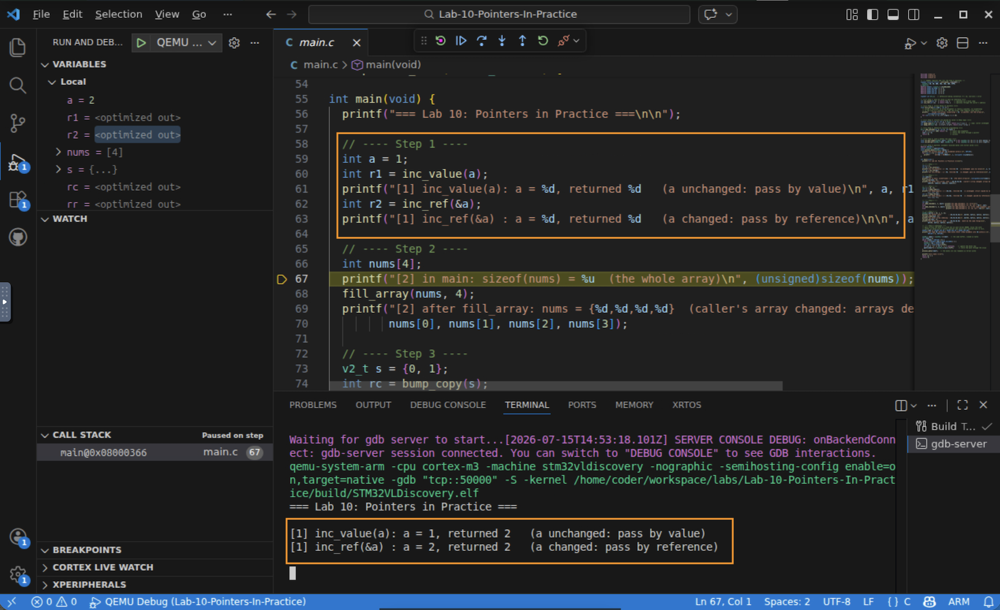
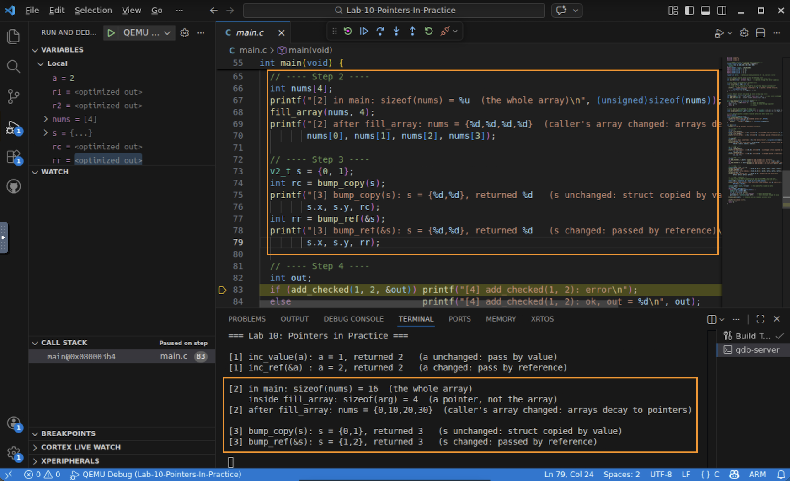
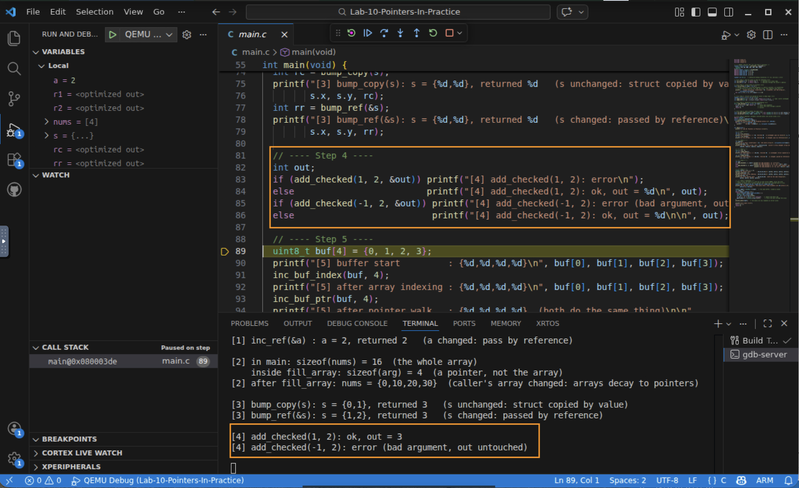
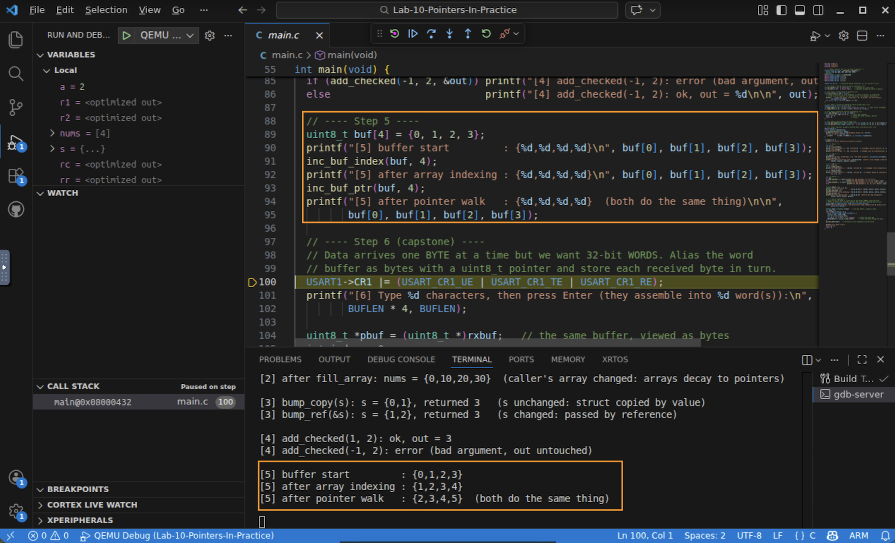
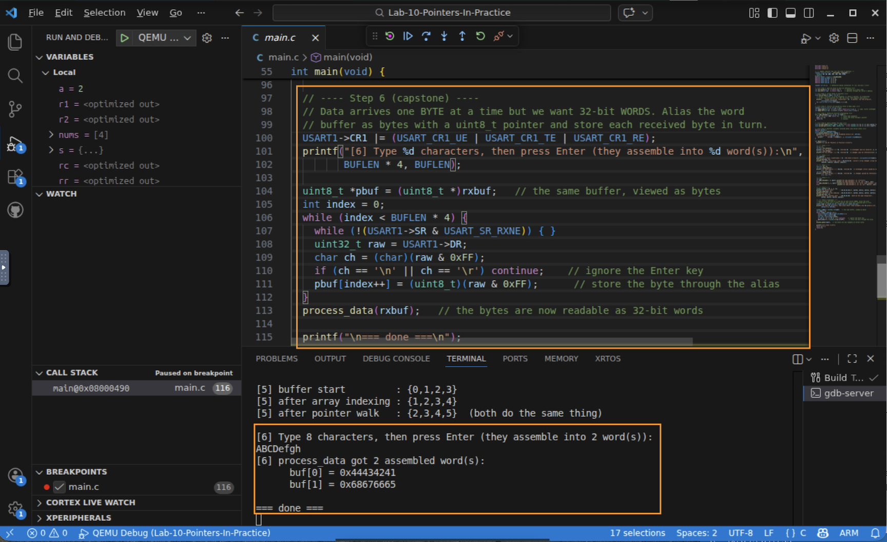

# Lab 10 — Pointers in Practice

## In this lab you will
- Contrast pass by value and pass by reference (using C pointers), and see how C uses pointers to reach back and change a caller's data.
- Watch arrays decay to pointers, structs get deep-copied, and buffers walked by both array indexing and pointer arithmetic.
- Finish the module with a USART receive handler that assembles incoming bytes into 32-bit words through a pointer alias, tying together pointers, type-aware access, and endianness.

## Before you begin
- Prerequisites: watch the *Pointers in Practice* video, and complete Labs 8 and 9 (the USART map and type-aware reads return here in).
- The one idea under all of it: C only ever passes by value. A pointer *is* a value (a 32-bit address); passing that address is how we get "pass by reference."
- Starter code: a single `main.c`. Steps 1 to 5 print automatically; Step 6 is interactive (you type characters).

## Step 1 — Pass by value vs pass by reference (C pointer)
```c
int inc_value(int x)  { return ++x; }   // works on a local copy
int inc_ref(int *x)   { return ++*x; }  // works through the caller's address
```
`inc_value(a)` returns 2 but leaves `a` at 1 — it only changed a copy. `inc_ref(&a)` changes `a` to 2, because it was handed the *address* of `a` and dereferenced it.



✅ Checkpoint: you can explain why one function changed `a` and the other did not.

## Step 2 — Arrays decay to pointers
Pass an array to a function and the function receives a pointer, not a copy, so it edits the caller's array directly:
```
[2] in main: sizeof(nums) = 16       (the whole array: 4 ints)
    inside fill_array: sizeof(arg) = 4  (just a pointer!)
[2] after fill_array: nums = {0,10,20,30}   (caller's array changed)
```
That size difference *is* the decay: `nums` is a 16-byte array in `main`, but the function parameter is a 4-byte pointer. The compiler even warns about `sizeof(arg)` here (`-Wsizeof-array-argument`) — a helpful nudge, not a bug. Because arrays are passed by pointer for free, there is no expensive "deep copy."

   

✅ Checkpoint: you can state why `sizeof` differs between `main` and the function.

## Step 3 — Structs are passed by value (a deep copy)
Unlike arrays, a whole struct is copied when passed by value:
```c
int bump_copy(v2_t s)  { s.x++; s.y++; ... }   // copy: caller's struct unchanged
int bump_ref(v2_t *s)  { s->x++; s->y++; ... } // pointer: caller's struct changes
```
`bump_copy` leaves `s` as `{0,1}`; `bump_ref` makes it `{1,2}`. Passing a big struct by value copies every byte onto the stack — passing a pointer costs only 4 bytes. As structs grow, prefer the pointer.

✅ Checkpoint: you can say why passing structs by value can be expensive.

## Step 4 — Defensive function programming
A common convention: the function's return value is an error code, and real results come back through a pointer argument.
```c
err_t add_checked(int a, int b, int *out);   // 0 = ok, non-zero = bad input
if (add_checked(a, b, &result)) { /* handle error */ } else { /* use result */ }
```
The lab runs a valid call (`out = 3`) and one that fails its argument check (returns an error, leaves `out` untouched). The caller checks success with a single compact `if`.

   

✅ Checkpoint: you can describe how the caller learns whether the call succeeded.

## Step 5 — Walk a buffer two ways
The same buffer, two syntaxes that do the identical thing:
```c
for (k = 0; k < n; k++) buf[k]  += 1;   // array indexing
for (k = 0; k < n; k++) *(buf++) += 1;  // pointer arithmetic
```
The output shows the buffer climb `{0,1,2,3} -> {1,2,3,4} -> {2,3,4,5}`. Use whichever reads more clearly; under the hood they are the same.

 


✅ Checkpoint: you can rewrite an array-indexing loop as a pointer-arithmetic loop.

---

## Step 6 — Assemble received bytes into 32-bit words
This is the module finale: data arrives one byte at a time, but we want 32-bit words. We alias the word buffer as bytes with a `uint8_t *` and store each received byte in turn:
```c
static uint32_t rxbuf[BUFLEN];          // the words we ultimately want
uint8_t *pbuf = (uint8_t *)rxbuf;       // the SAME memory, viewed as bytes
...
pbuf[index++] = (uint8_t)(USART1->DR & 0xFF);   // Lab 9's mask + cast, into the alias
if (index == BUFLEN * 4) process_data(rxbuf);   // a full set of words has arrived
```
1. Run it. When you reach Step 6, type 8 characters and press Enter.
2. `process_data` prints the assembled words. If you type `ABCDEFGH`:
   ```
   buf[0] = 0x44434241
   buf[1] = 0x48474645
   ```
   Look closely: `A` (0x41) is the low byte of `buf[0]`, not the high byte. The bytes fill from the low end because the Cortex-M is little-endian (Module 2). Three ideas reappear here: pointers (the `uint8_t *` alias), type-aware access (mask and cast the byte), and endianness (how the bytes land in the word).

   

✅ Checkpoint: you can explain how one buffer is written as bytes and read as words, and why `A` lands in the low byte.

## Troubleshooting
| Symptom | Likely cause | Fix |
|--------|--------------|-----|
| Build prints a `sizeof` warning | Expected in Step 2 | `-Wsizeof-array-argument` is the compiler confirming the array decayed to a pointer. Leave it |
| Step 6 never finishes | Fewer than 8 characters received | Type 8 characters, then press Enter |
| Assembled words look byte-swapped | That is little-endian, not a bug | The first byte you type is the low byte of the word. This is correct |


## Check your understanding
1. Why does `inc_value` fail to change the caller's variable while `inc_ref` succeeds?
2. Why is `sizeof` different for an array in `main` versus the same array as a function parameter?
3. Passing a large struct by value is discouraged. What is the cost, and the fix?
4. You typed `ABCD` and got `buf[0] = 0x44434241`. Explain the byte order.

## Wrap-up
You put pointers to work: pass by reference, array decay, struct deep-copies, defensive return-code conventions, and two ways to walk a buffer. The capstone assembled a byte stream into words through a pointer alias, uniting pointers, type-aware access, and endianness. That completes Module 3. Next you will learn to organize this kind of code into reusable modules and event-driven callbacks.
