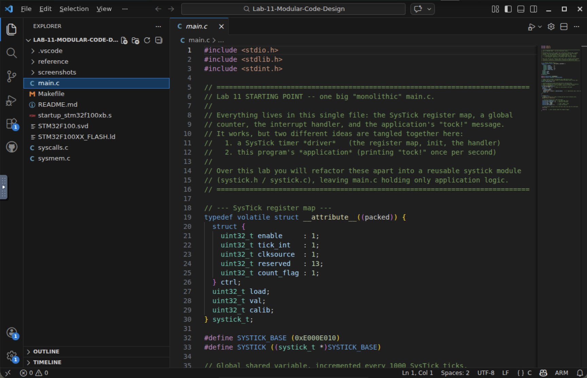
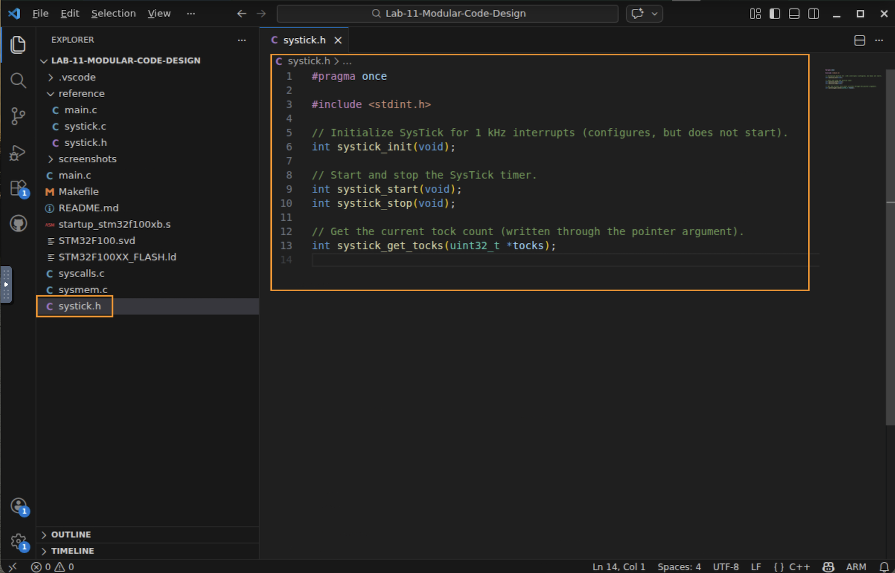
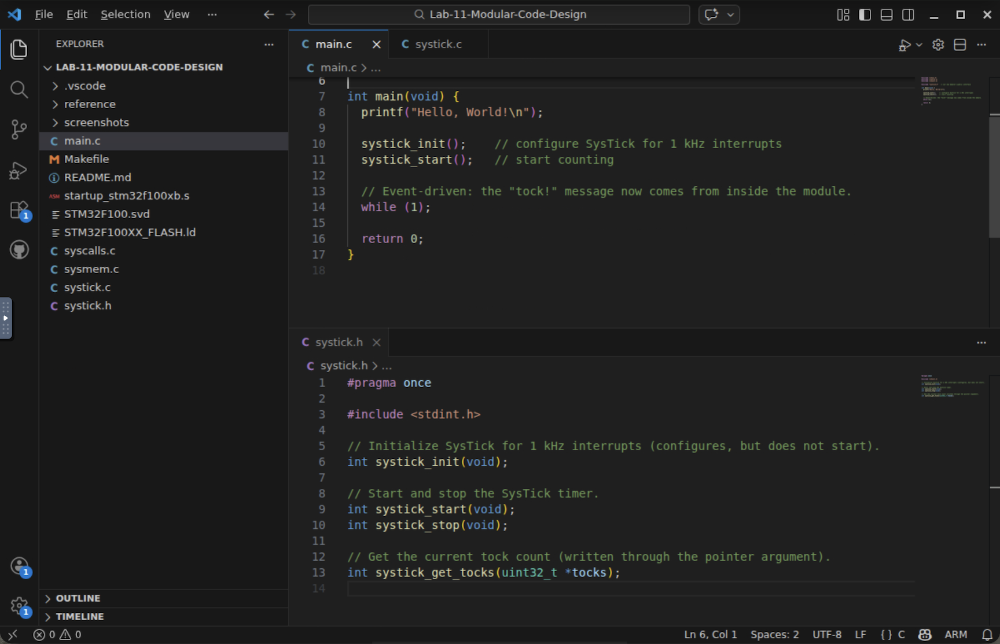
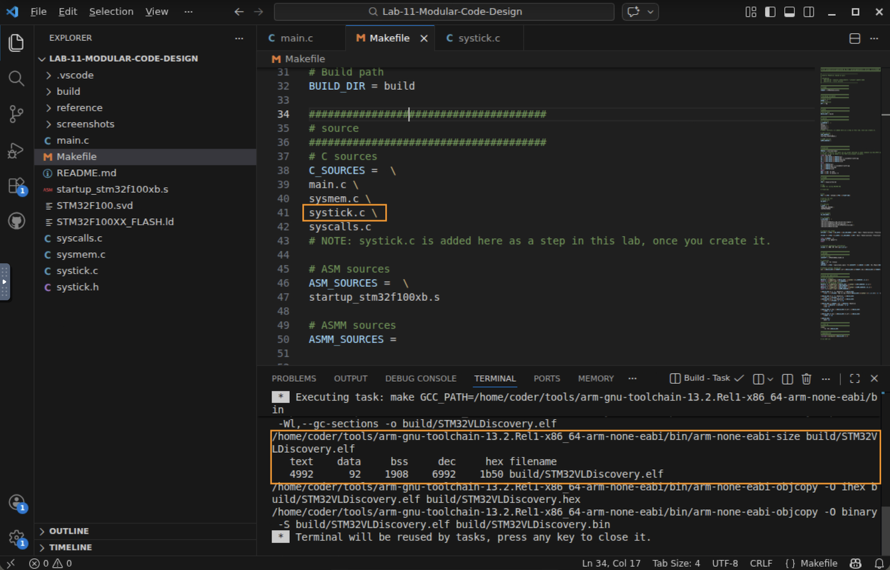
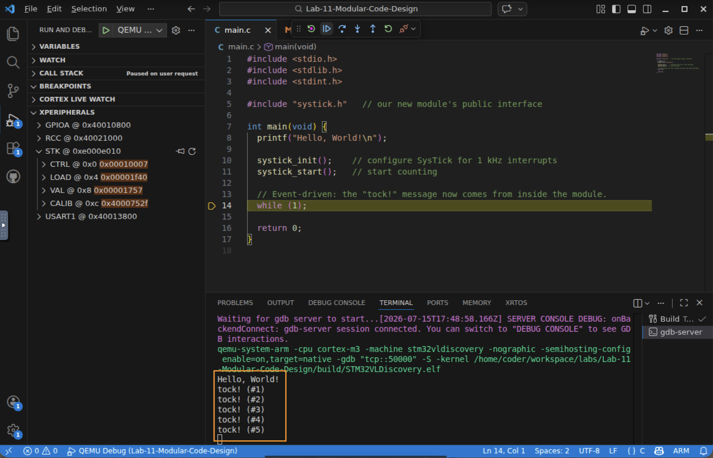
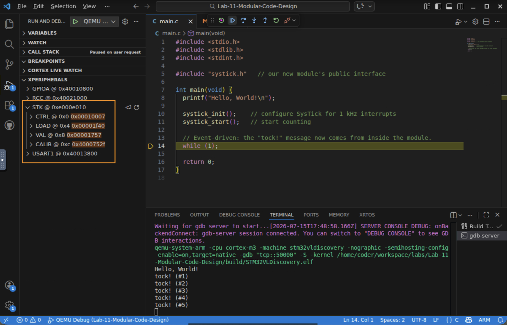

# Lab 11 — Modular Code Design

## In this lab you will
- Take a working but monolithic `main.c` and refactor it into a reusable SysTick module (`systick.h` + `systick.c`), without changing what the program does.
- Practice the core moves of modular C: an interface in a header, `#pragma once`, information hiding with `static`, and defensive return codes.
- See why one line — the `printf("tock!")` — *cannot* cleanly leave the driver yet, setting up function pointers (Lab 12) and callbacks (Lab 13).

## Before you begin
- Prerequisites: watch the *Modular Code Design* video. You should be comfortable with the SysTick timer (Lab 7) and the return-code convention.
- The big idea: code rarely starts organized. Once it *works*, you refactor, reshaping it into readable, reusable modules without changing its behavior.
- Starter code: a single `main.c` that already runs. You will pull a module out of it, step by step, exactly as the video does.

> This lab is a "code along with the video" exercise. Each step below matches an edit made on screen. If you get stuck, the finished files are in [reference/](reference/) — try each step yourself first, then compare.

---

## Step 0 — Read the monolith and run it
Open `main.c`. Everything lives in this one file, and it mixes two different ideas:
1. a SysTick driver — the register map, the 1 kHz setup, and `SysTick_Handler`
2. this program's application — printing `tock!` once per second

Build and run it first so you know your starting point works:

```
tock! (#1)
tock! (#2)
tock! (#3)
```



✅ Checkpoint: you can point to the "driver" parts and the "application" part in the single file.

## Step 1 — Create the interface: `systick.h`
A module is defined by what it offers to the outside world. Create a new file `systick.h` and declare that interface. Start with an include guard so the header is only ever pulled in once:

```c
#pragma once

#include <stdint.h>

// Initialize SysTick for 1 kHz interrupts (configures, but does not start).
int systick_init(void);

// Start and stop the SysTick timer.
int systick_start(void);
int systick_stop(void);

// Get the current tock count (written through the pointer argument).
int systick_get_tocks(uint32_t *tocks);
```

Notice the design decisions:
- Return codes, not `void` — each call reports success or failure (defensive coding).
- `systick_get_tocks` returns its result through a pointer and keeps the return value for an error code.
- We include `<stdint.h>` here because the header itself mentions `uint32_t`.



✅ Checkpoint: you can explain what `#pragma once` prevents.

## Step 2 — Create `systick.c` and move the register map
Create `systick.c`, include your header, and cut the SysTick register map out of `main.c` into it:

```c
#include "systick.h"

#include <stdlib.h>
#include <stdio.h>

// --- SysTick register map (kept HERE, not in the header) ---
typedef volatile struct __attribute__((packed)) {
  struct {
    uint32_t enable     : 1;
    uint32_t tick_int   : 1;
    uint32_t clksource  : 1;
    uint32_t reserved   : 13;
    uint32_t count_flag : 1;
  } ctrl;
  uint32_t load;
  uint32_t val;
  uint32_t calib;
} systick_t;

#define SYSTICK_BASE (0xE000E010)
#define SYSTICK ((systick_t *)SYSTICK_BASE)
```

Why does the memory map go in `systick.c` and not in the header? Because it is an implementation detail. If we exposed it in `systick.h`, other files could reach around our interface and poke the hardware directly — exactly what a module is meant to prevent.

✅ Checkpoint: you can say why the register map is hidden in the `.c`, not published in the `.h`.

## Step 3 — Move the handler and hide the counter with `static`
Cut `SysTick_Handler` and the `systick_tocks` counter out of `main.c` into `systick.c`. As you move the counter, change it from a global to a module-level `static`:

```c
// Module-level shared variable. `static` hides it from other .c files
// but leaves it visible to everything inside this module.
static uint32_t systick_tocks = 0;

void SysTick_Handler(void) {
  static int ticks = 0;
  ticks++;
  if (ticks == 1000) {
    systick_tocks++;
    printf("tock! (#%ld)\n", systick_tocks);   // still here — see Step 6
    ticks = 0;
  }
}
```

`static` at file scope means information hiding: `systick_tocks` is no longer visible to `main.c` or any other file. The only way in from outside is through `systick_get_tocks()`. That is the whole point of a module — a small, controlled interface over hidden internals.

✅ Checkpoint: you can state the difference between a *global* variable and a *file-scope `static`* variable.

## Step 4 — Move `init` / `start` / `stop`, and add defensive checks
Move the 1 kHz setup out of `main`'s body into `systick_init`, and split "configure" from "start." Add a couple of small safety checks:

```c
int systick_init(void) {
  if (SYSTICK->ctrl.enable == 1) {
    return -1;                   // don't reconfigure a running timer
  }
  SYSTICK->ctrl.clksource = 1;   // use the 8 MHz clock
  SYSTICK->ctrl.tick_int  = 1;   // generate interrupts
  SYSTICK->val  = 8000;
  SYSTICK->load = 8000;          // 8 MHz / 8000 = 1 kHz
  return 0;
}

int systick_start(void) { SYSTICK->ctrl.enable = 1; return 0; }
int systick_stop(void)  { SYSTICK->ctrl.enable = 0; return 0; }

int systick_get_tocks(uint32_t *tocks) {
  if (tocks == 0) return -1;     // NULL pointer guard
  *tocks = systick_tocks;
  return 0;
}
```

Two judgment calls the video highlights:
- `systick_init` no longer *starts* the timer — starting is now an explicit `systick_start()` call. Separating configuration from activation is a common, clean design.
- Don't over-generalize. We added `stop` and `get_tocks` on a hunch they'll be useful, but building a "universal" SysTick driver for a single project just adds code, size, and bug surface. Match the interface to your actual needs.

✅ Checkpoint: you can describe what `systick_init` returns if the timer is already running, and why.

## Step 5 — Clean up `main.c`
Back in `main.c`, delete everything you moved and `#include "systick.h"`. What remains is pure application intent:

```c
#include <stdio.h>
#include <stdlib.h>
#include <stdint.h>

#include "systick.h"

int main(void) {
  printf("Hello, World!\n");

  systick_init();
  systick_start();

  while (1);
  return 0;
}
```

Read that `main` out loud — "initialize SysTick, start it" — and it says exactly what it does. Descriptive names and a small interface are what make code readable and maintainable.



✅ Checkpoint: your `main.c` no longer mentions `SYSTICK`, the register map, or `systick_tocks` directly.

## Step 6 — Add `systick.c` to the Makefile, then build
The compiler needs to know about your new source file. Open the `Makefile` and add `systick.c` to the `C_SOURCES` list:

```make
C_SOURCES =  \
main.c \
sysmem.c \
syscalls.c \
systick.c
```

Now build. If you forget this step you'll get an "undefined reference to `systick_init`" link error — the classic new-file gotcha.



✅ Checkpoint: the project builds clean with `systick.c` compiled.

## Step 7 — Run it and confirm nothing changed
Run in QEMU. The behavior is identical to Step 0 — that's the goal of a refactor:

```
Hello, World!
tock! (#1)
tock! (#2)
tock! (#3)
```



Optional — inspect SysTick with the SVD Peripherals view. Press `F5` to start a debug session, open Peripherals, and expand STK. You can watch `CTRL` (ENABLE / TICKINT / CLKSOURCE), `LOAD`, and `VAL` — the exact bits `systick_init` and `systick_start` set. (An `STM32F100.svd` is already wired into `launch.json`.)



✅ Checkpoint: the refactored program behaves exactly like the monolith did.

---

## The one loose end (and where the module goes next)
Look back at `SysTick_Handler` in `systick.c`. That `printf("tock!")` is application-specific — it does not belong in a generic timer driver. But we can't just delete it: the handler is the only code that runs on each interrupt.

To move that line back into `main.c` where application code belongs, the driver needs a way to call *some function of the application's choosing* every second — a function it knows nothing about in advance. That mechanism is a function pointer (Lab 12), used to build a callback (Lab 13). By the end of the module, `systick.c` will be fully generic and reusable.

## Troubleshooting
| Symptom | Likely cause | Fix |
|--------|--------------|-----|
| `undefined reference to systick_init` | `systick.c` not in the build | Add `systick.c` to `C_SOURCES` in the `Makefile` (Step 6) |
| Header errors about `uint32_t` | Missing include | `#include <stdint.h>` in `systick.h` |
| `systick.h` seems included twice | No include guard | Add `#pragma once` at the top of `systick.h` |
| `main.c` can read `systick_tocks` directly | Counter still global | Make it `static` inside `systick.c`; use `systick_get_tocks()` |
| No `tock!` output | Timer configured but not started | `systick_init()` only configures; you must also call `systick_start()` |

## Check your understanding
1. Why does the SysTick register map belong in `systick.c` rather than `systick.h`?
2. What does making `systick_tocks` `static` change about who can access it?
3. `systick_init` splits "configure" from "start." Give one reason that separation is useful.
4. Why can't the `printf("tock!")` simply move into `main.c` at this stage?

## Wrap-up
You refactored a working monolith into a clean, reusable SysTick module — moving the register map and handler into `systick.c`, hiding the counter with `static`, exposing a small return-code interface through `systick.h`, and reducing `main.c` to application intent. The program's behavior never changed; only its structure did. The single stubborn line left in the driver — that `printf` — is the thread we pull next, with function pointers.
