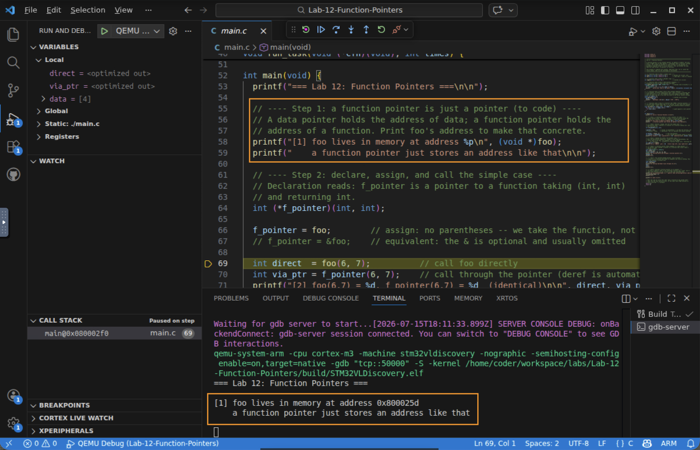
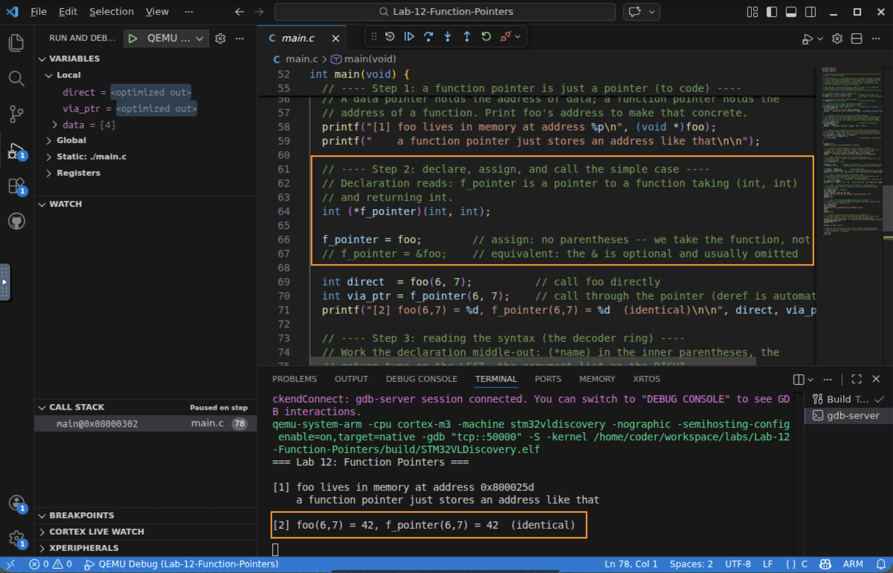
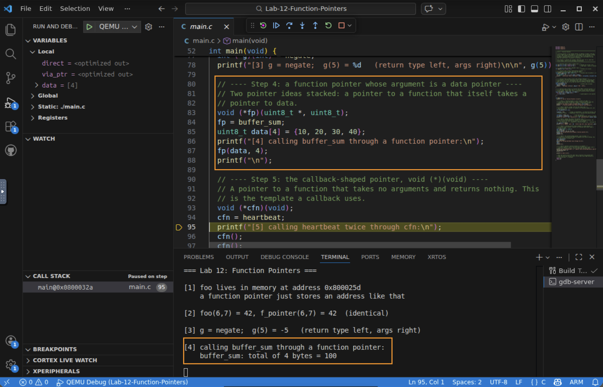
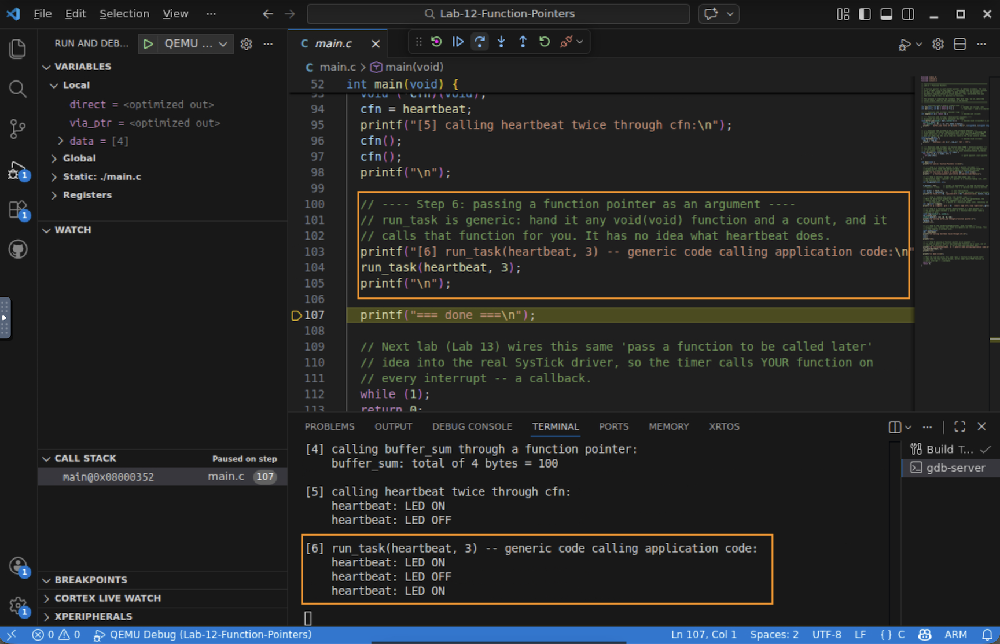

# Lab 12 — Function Pointers

## In this lab you will
- Treat a function pointer as just another pointer: an address in memory that happens to hold executable code instead of data.
- Declare, assign, and call function pointers, and learn to *read* the syntax with a reliable "middle-out" method.
- Build up to the callback template: a `void (*)(void)` pointer, and a generic function that takes a function pointer as an argument and calls it — the exact mechanism Lab 13 uses for callbacks.

## Before you begin
- Prerequisites: watch the *C Function Pointers* video. You should be comfortable with data pointers and struct/register pointers (Lab 6).
- The one idea under all of it: a function pointer is just a pointer. You already point at data (`uint32_t *`) and at peripheral register blocks (a struct pointer). Now you point at a *function* — code stored at an address, just like everything else in memory.
- Starter code: a single, complete `main.c`. It already runs. Read each step, run it, watch the serial output, then do the challenges at the end.

> This is a read-run-tinker lab. Function pointers are learned fastest by studying working examples and then modifying them, so the program ships complete rather than as blanks to fill in.

---

## Step 1 — A function pointer is just a pointer (to code)
A data pointer holds the address of *data*. A function pointer holds the address of a *function*. That is the whole idea — the rest is syntax. The program prints where `foo` lives:

```
[1] foo lives in memory at address 0x800025d
```

That address is in flash (the `0x08000000` region), because that is where your program's code is stored. A function pointer just holds an address like this one.



✅ Checkpoint: you can explain how a function pointer differs from a data pointer (what it points *at*).

## Step 2 — Declare, assign, and call the simple case
```c
int (*f_pointer)(int, int);   // f_pointer points to a function (int,int) -> int

f_pointer = foo;              // assign -- NO parentheses (we take the function, not call it)
// f_pointer = &foo;          // equivalent: the & is optional and usually omitted

int via_ptr = f_pointer(6, 7);   // call through the pointer (the deref is automatic)
```

Three facts the video stresses:
1. Assignment uses no parentheses. `f_pointer = foo;` stores the function's address. `f_pointer = foo();` would *call* `foo` and store its return value — a different thing entirely.
2. `&foo` and `foo` are equivalent in the assignment. The `&` is optional and usually left off.
3. Calling through the pointer looks like a normal call. `f_pointer(6, 7)` gives the same result as `foo(6, 7)`; the dereference happens for you.

```
[2] foo(6,7) = 42, f_pointer(6,7) = 42  (identical)
```



✅ Checkpoint: you can say why `f_pointer = foo;` has no parentheses but `f_pointer(6,7)` does.

## Step 3 — Reading the syntax (the decoder ring)
The declaration syntax is the confusing part. Read it middle-out:

```
int (*g)(int);
     ^^^^        (*g)      -> g is a pointer
^^^              int       -> ...to a function RETURNING int      (left of the name)
        ^^^^^    (int)     -> ...that TAKES an int                (right of the name)
```

So: *return type on the left, argument list on the right, `(*name)` in the middle.* Practice on these:

| Declaration | Reads as |
|---|---|
| `int (*p)(int, int);` | `p` points to a function `(int, int)` returning `int` |
| `void (*q)(uint8_t *, uint8_t);` | `q` points to a function `(uint8_t *, uint8_t)` returning nothing |
| `void (*r)(void);` | `r` points to a function taking nothing, returning nothing |

The program assigns `g = negate;` and calls it:

```
[3] g = negate;  g(5) = -5   (return type left, args right)
```

✅ Checkpoint: you can read `void (*q)(uint8_t *, uint8_t);` out loud correctly.

## Step 4 — A function pointer whose argument is a data pointer
Now stack two pointer ideas: a pointer to a function that *itself* takes a pointer to data.

```c
void (*fp)(uint8_t *, uint8_t);
fp = buffer_sum;                 // buffer_sum(uint8_t *buf, uint8_t n)
uint8_t data[4] = {10, 20, 30, 40};
fp(data, 4);                     // call it through the pointer
```

`buffer_sum` walks the array and prints the total — this is the payoff of the pointer work from Module 3.

```
[4] calling buffer_sum through a function pointer:
    buffer_sum: total of 4 bytes = 100
```



✅ Checkpoint: you can point to the two different pointers involved in `fp(data, 4)`.

## Step 5 — The callback-shaped pointer: `void (*)(void)`
A pointer to a function that takes no arguments and returns nothing. This is a common template a callback uses:

```c
void (*cfn)(void);
cfn = heartbeat;   // heartbeat(void): flips a state and prints it
cfn();
cfn();
```

`heartbeat` flips a simulated LED state and prints it. On real hardware this would toggle a GPIO pin; QEMU does not model the LED, so we show the state on the console instead.

```
[5] calling heartbeat twice through cfn:
    heartbeat: LED ON
    heartbeat: LED OFF
```

✅ Checkpoint: you can write the declaration for a pointer to a no-argument, no-return function from memory.

## Step 6 — Passing a function pointer as an argument
A regular function can take a function pointer as a parameter. `run_task` is completely generic — hand it any `void(void)` function and a count, and it calls that function for you:

```c
void run_task(void (*cfn)(void), int times) {
  for (int i = 0; i < times; i++)
    if (cfn) cfn();        // guard against a null pointer, then call
}
...
run_task(heartbeat, 3);
```

`run_task` has no idea what `heartbeat` does — it just calls what it was handed. That is the whole idea behind a callback: general-purpose code calling application-specific code it knows nothing about.

```
[6] run_task(heartbeat, 3) -- generic code calling application code:
    heartbeat: LED ON
    heartbeat: LED OFF
    heartbeat: LED ON
```



✅ Checkpoint: you can explain why `run_task` does not need to know what function it is calling.

---

## Try it yourself
1. Repoint the pointer. A `bar(int,int)` (addition) function is already in the file. In Step 2, change `f_pointer = foo;` to `f_pointer = bar;` and rerun — the call site `f_pointer(6,7)` now prints `13` without any other change. That flexibility is the point.
2. Write your own task. Add a second `void(void)` function (say, one that prints a counter) and hand it to `run_task`. Confirm `run_task` calls it just like `heartbeat`.
3. (Stretch) Array of function pointers. Make a `void (*tasks[])(void) = { heartbeat, your_task };` and call each one in a loop. This is your first *dispatch table* — a common real-world use of function pointers.

## Troubleshooting
| Symptom | Likely cause | Fix |
|--------|--------------|-----|
| "expected identifier" on the declaration | Missing parentheses around `*name` | Write `int (*f)(int,int);`, not `int *f(int,int);` (the second is a function returning a pointer) |
| Type-mismatch warning on assignment | Signature does not match | The pointer's return type and argument list must match the function exactly |
| Program crashes when a pointer is called | Pointer never assigned (or set to NULL) | Assign it before calling; `run_task` guards with `if (cfn)` for this reason |

## Check your understanding
1. Why does `f_pointer = foo;` have no parentheses, while `f_pointer(6,7)` does?
2. Read `void (*q)(uint8_t *, uint8_t);` in plain English.
3. In `run_task(heartbeat, 3)`, how does `run_task` "know" which function to call?
4. What has to match between a function pointer and the function you assign to it?

## Wrap-up
You extended the idea of a pointer one final step from data, to registers, to functions. You declared and called function pointers, learned to read their syntax middle-out, passed a data pointer through one, and reached the callback template: a generic function that takes a `void(void)` pointer and calls it. Next, Lab 13 wires exactly this mechanism into the SysTick driver, so the timer calls *your* application function on every interrupt — an event-driven callback.
