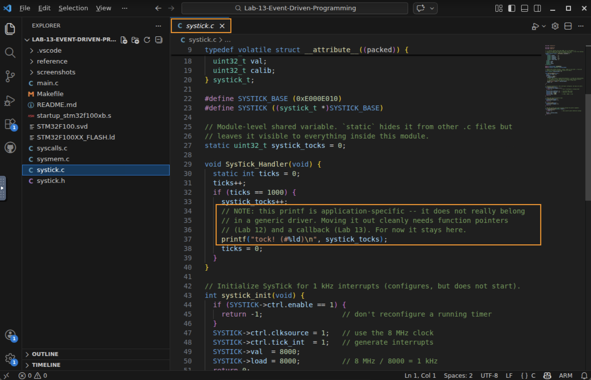
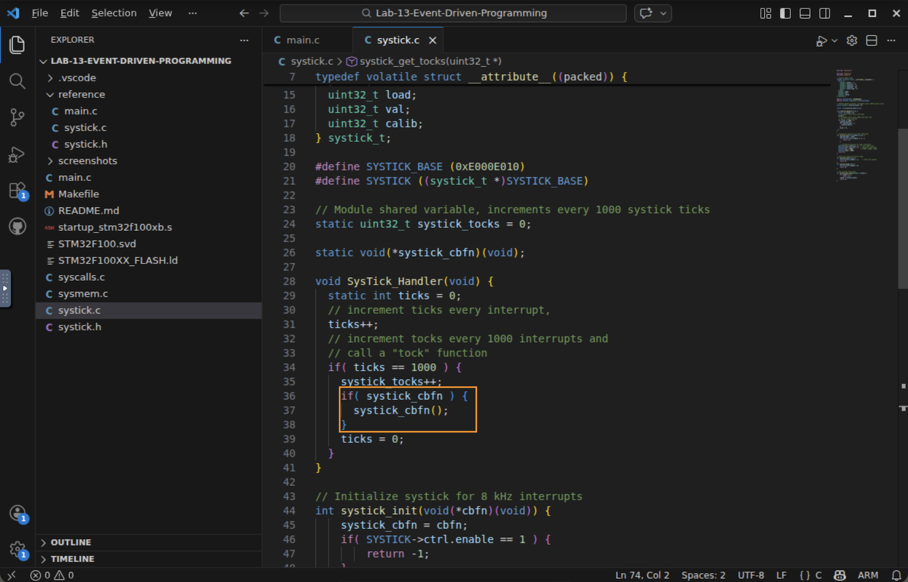
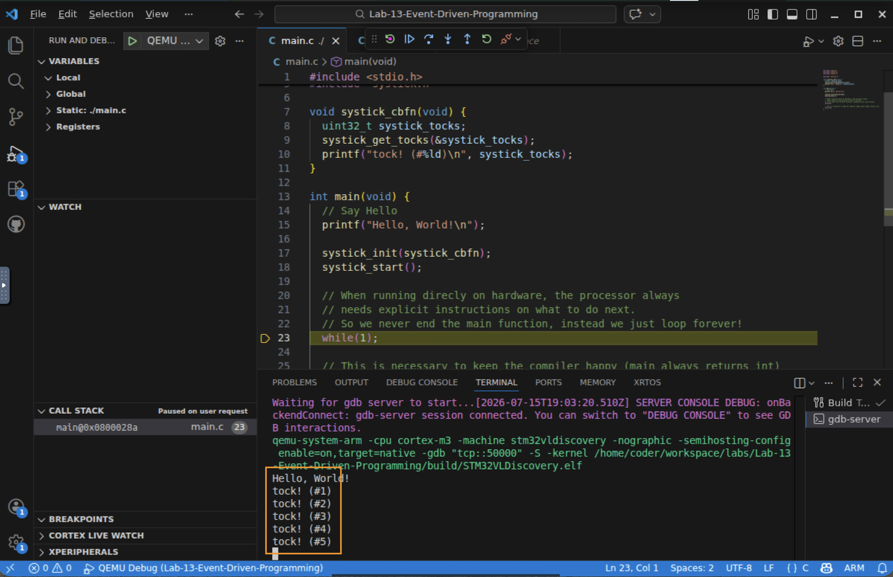

# Lab 13 — Event-Driven Programming with Callbacks

## In this lab you will
- Remove the last piece of application code trapped inside a generic driver, using a callback.
- Change `systick_init` to accept a `void (*)(void)` function pointer, store it in the module, and call it from the interrupt handler.
- Make `systick.c` fully general and reusable — completing the arc from raw registers to an event-driven callback architecture.

## Before you begin
- Prerequisites: watch the *Event-Driven Programming with Callback Functions* video, and complete Lab 11 (modular design) and Lab 12 (function pointers). This lab uses both directly.
- Starter code: the finished Lab 11 code — `main.c`, `systick.c`, `systick.h`. It builds and runs right now, printing `tock!` once per second.
- The one idea: a callback lets a general-purpose driver call an application function it knows nothing about. The driver holds a function pointer (Lab 12) and invokes it when an event occurs.

> This is a "code along with the video" refactor. Each step matches an edit made on screen. The finished files are in [reference/](reference/) — try each step yourself first, then compare.

---

## Step 0 — Find the one remaining wart
Open `systick.c` and look at `SysTick_Handler`:

```c
void SysTick_Handler(void) {
  static int ticks = 0;
  ticks++;
  if (ticks == 1000) {
    systick_tocks++;
    printf("tock! (#%ld)\n", systick_tocks);   // <-- application code, inside a generic driver
    ticks = 0;
  }
}
```

The counting logic is generic timer behavior — that belongs in the driver. But `printf("tock!")` is *this program's* application-specific behavior. A truly reusable SysTick module should not decide to print anything. 



✅ Checkpoint: you can explain why the `printf` does not belong in `systick.c`.

## Step 1 — Move the application code into `main.c`
Cut the `printf` out of the handler and give it a home in `main.c` as a small function. It fetches the count through the module's public interface:

```c
// main.c — application-specific "what to do on each tock"
void systick_cbfn(void) {
  uint32_t systick_tocks;
  systick_get_tocks(&systick_tocks);          // read the count through the interface
  printf("tock! (#%ld)\n", systick_tocks);
}
```

Note it uses `systick_get_tocks(&...)` — the accessor from Lab 11 — because the counter is hidden (`static`) inside the module. This function has no arguments, no return value — exactly the `void (*)(void)` template from Lab 12.

✅ Checkpoint: you can explain why `systick_cbfn` reads the count with `systick_get_tocks` instead of touching `systick_tocks` directly.

## Step 2 — Let the driver accept a callback
Change the interface so the module can be told *which* function to call. Update the prototype in `systick.h`:

```c
// systick.h
int systick_init(void (*cbfn)(void));   // pass the function to call on each tock
```

That parameter is precisely the function-pointer type you practiced in Lab 12: a pointer to a function taking nothing and returning nothing.


> *Screenshot: `main.c` showing `systick_cbfn` and the new `systick_init(void (*cbfn)(void))` prototype in `systick.h`.*

✅ Checkpoint: you can read the type `void (*cbfn)(void)` out loud.

## Step 3 — Store the pointer inside the module
In `systick.c`, add a file-scope `static` function pointer to remember the callback, and save the passed-in pointer inside `systick_init`:

```c
// systick.c
static void (*systick_cbfn)(void);   // module-level; auto-initialized to 0 (NULL)

int systick_init(void (*cbfn)(void)) {
  systick_cbfn = cbfn;               // remember the application's function
  if (SYSTICK->ctrl.enable == 1) return -1;
  SYSTICK->ctrl.clksource = 1;
  SYSTICK->ctrl.tick_int  = 1;
  SYSTICK->val  = 8000;
  SYSTICK->load = 8000;
  return 0;
}
```

Because it is `static`, the pointer is hidden from other files and starts out `0` (NULL) until `systick_init` sets it.

✅ Checkpoint: you can explain what value `systick_cbfn` holds before `systick_init` is called.

## Step 4 — Call the callback from the handler (defensively)
Replace the deleted `printf` with a guarded call to the stored pointer:

```c
void SysTick_Handler(void) {
  static int ticks = 0;
  ticks++;
  if (ticks == 1000) {
    systick_tocks++;
    if (systick_cbfn) {          // NULL guard — only call if one was registered
      systick_cbfn();
    }
    ticks = 0;
  }
}
```

The `if (systick_cbfn)` guard is the same defensive check from Lab 12: never call through a null pointer. Now the handler does only generic timer work — count, and notify whoever registered interest.



✅ Checkpoint: you can say why the handler guards the call with `if (systick_cbfn)`.

## Step 5 — Wire it together in `main.c`
Finally, register the callback by passing it to `systick_init`:

```c
int main(void) {
  printf("Hello, World!\n");

  systick_init(systick_cbfn);   // hand the driver our function to call each tock
  systick_start();

  while (1);
  return 0;
}
```

Passing `systick_cbfn` (no parentheses — you are passing the function, not calling it) hands the driver the address of your application function. From now on, every 1000 ticks the driver calls back into `main.c`.

✅ Checkpoint: you can explain why `systick_init(systick_cbfn)` has no parentheses after `systick_cbfn`.

## Step 6 — Build, run, and confirm
Build and run in QEMU. The output is identical to Lab 11:

```
Hello, World!
tock! (#1)
tock! (#2)
tock! (#3)
```

Same behavior — but the design is fundamentally better. `systick.c` no longer contains a single line specific to this program. Drop it into any project, register a different callback, and it just works.



> Watch out for the argument-count slip. `systick_get_tocks` returns its result *through a pointer*, so it must be called as `systick_get_tocks(&systick_tocks)`. Forgetting the `&` (or the argument) is the exact "too few arguments" warning I stumbled into in the video — a good reminder of the return-code-plus-pointer convention.

✅ Checkpoint: the program behaves exactly as before, but `systick.c` has no application-specific code left.

---

## Troubleshooting
| Symptom | Likely cause | Fix |
|--------|--------------|-----|
| No `tock!` output, but the timer runs | Callback never registered | Pass it in: `systick_init(systick_cbfn)` |
| Crash on the first tock | Calling an unassigned/NULL pointer | Keep the `if (systick_cbfn)` guard; make sure `systick_init` stores the pointer |
| `main.c` cannot read `systick_tocks` | It is `static` inside the module | Read it through `systick_get_tocks(&...)`, not directly |
| Passing the callback calls it immediately | Parentheses on the argument | Pass `systick_cbfn`, not `systick_cbfn()` |

## Check your understanding
1. Why does moving `printf` into `main.c` make `systick.c` more reusable?
2. What type is `systick_cbfn` inside `systick.c`, and what value does it hold before `systick_init` runs?
3. Why does the handler guard the call with `if (systick_cbfn)`?
4. In `systick_init(systick_cbfn)`, why is there no `()` after `systick_cbfn`?

## Wrap-up
You built a callback architecture: a generic SysTick driver that calls an application function, handed to it as a function pointer, every time its event occurs, without knowing or caring what that function does. This is the culmination of the whole course: you went from toggling raw registers, to typed memory and pointers, to interrupts and modular design, to function pointers, and finally to event-driven callbacks — the pattern professional embedded code is built on. 

Congratulations on finishing the course, and loading your C-programming for hardware toolbox with a collection of valuable tools.
